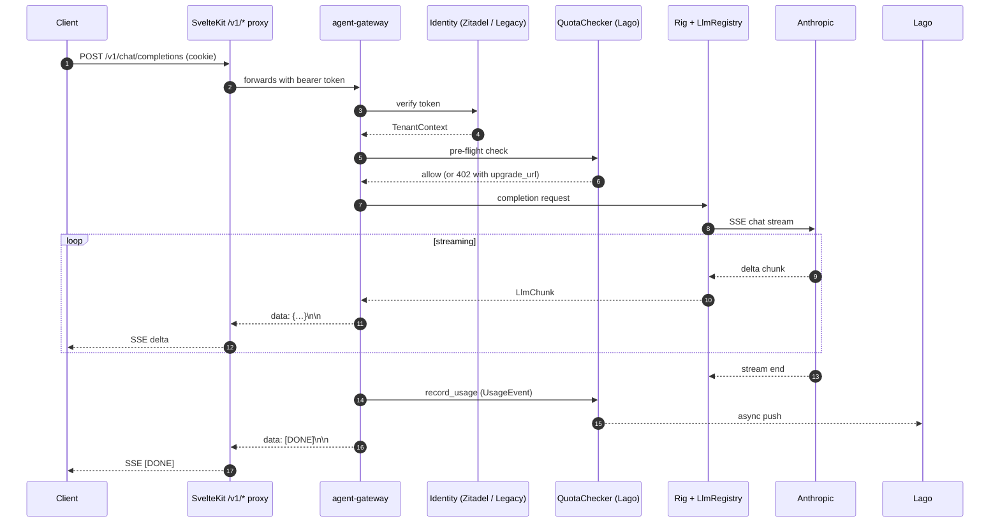
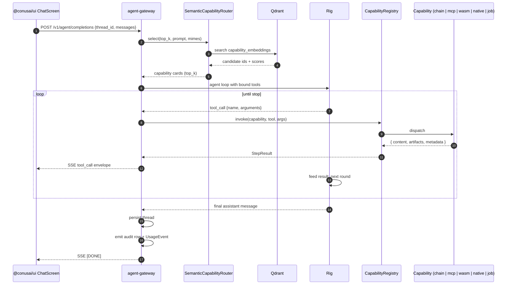
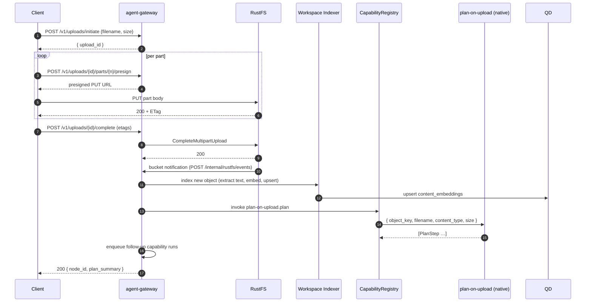

# ConusAI Platform — Architecture Reference

> **Audit date:** 2026-05-26
> **Workspace version:** 0.3.1 (Cargo workspace), pnpm workspace `@conusai/*` 0.6.0
> **Status:** Source of truth — fully re-derived from current code. Supersedes all
> prior revisions of this file.
>
> This document is the canonical architecture reference for the ConusAI platform.
> It is generated by reading the repository directly (no inference from older
> docs) and is intentionally exhaustive: every HTTP route, every environment
> variable, every database table, every Tauri command, every UI primitive,
> every capability manifest field, every infra service. When you change the
> code, update this file in the same commit.

---

## Table of Contents

1. [Overview](#1-overview)
2. [Repository Topology](#2-repository-topology)
3. [Version Matrix](#3-version-matrix)
4. [Architectural Principles](#4-architectural-principles)
5. [Backend — Agent Gateway](#5-backend--agent-gateway)
   - 5.1 [Process Bootstrap & Router Assembly](#51-process-bootstrap--router-assembly)
   - 5.2 [Full HTTP Route Table](#52-full-http-route-table)
   - 5.3 [Middleware Chain](#53-middleware-chain)
   - 5.4 [Authentication Adapters](#54-authentication-adapters)
   - 5.5 [`agent-core` Module Map](#55-agent-core-module-map)
   - 5.6 [`common` Module Map](#56-common-module-map)
   - 5.7 [`billing-core` Module Map](#57-billing-core-module-map)
   - 5.8 [`jobs` Crate (Background Worker)](#58-jobs-crate-background-worker)
   - 5.9 [Capability Provider Taxonomy](#59-capability-provider-taxonomy)
   - 5.10 [Rig 0.36 Usage Map](#510-rig-036-usage-map)
   - 5.11 [Persistence Schema (redb, Qdrant, Postgres)](#511-persistence-schema-redb-qdrant-postgres)
   - 5.12 [Environment Variables](#512-environment-variables)
   - 5.13 [OpenAPI Assembly](#513-openapi-assembly)
   - 5.14 [Observability (Metrics, Traces, Logs)](#514-observability-metrics-traces-logs)
6. [Web App — `apps/web`](#6-web-app--appsweb)
7. [Browser Shell — `apps/browser-shell` (Tauri 2)](#7-browser-shell--appsbrowser-shell-tauri-2)
8. [Shared Packages](#8-shared-packages)
   - 8.1 [`@conusai/ui`](#81-conusaiui)
   - 8.2 [`@conusai/sdk`](#82-conusaisdk)
   - 8.3 [`@conusai/types`](#83-conusaitypes)
9. [Capability TOML Manifest Schema](#9-capability-toml-manifest-schema)
10. [Infrastructure & Tooling](#10-infrastructure--tooling)
11. [Sequence Diagrams](#11-sequence-diagrams)
12. [Operational Concerns](#12-operational-concerns)
13. [Appendix — File Trees](#13-appendix--file-trees)

---

## 1. Overview

ConusAI is a multitenant, plan-tiered AI agent platform. A user (or an external
client) talks to an **agent gateway** (Rust / Axum / Rig) which routes the turn
to a **capability** — an opaque tool implementation that can be:

- a **native** provider (Rust, compiled in)
- an **LLM chain** (data-driven prompt + JSON Schema, declared in TOML)
- a **remote MCP** server (JSON-RPC 2.0 over HTTPS)
- a **WASM** component (wasmtime 44, component-model)
- a **job-backed** capability (returns `task_id`, work runs on a tokio-cron worker)

A **semantic router** (Qdrant + per-capability embeddings + scoring) selects the
top-K candidates per turn; the **Rig 0.36 agent loop** drives tool-calls against
Anthropic (Claude). Memory, threads, audit logs, and workspace metadata live in
an embedded **redb** v2 keyspace; vector embeddings live in **Qdrant**; bulk
content (uploads, generated artefacts) lives in **RustFS** (S3-compatible,
Apache 2.0) keyed per tenant via STS-style scoped IAM users.

The frontend ships two surfaces from a single codebase:

- **`apps/web`** — SvelteKit web app, server-rendered, runs as a Node process
- **`apps/browser-shell`** — Tauri 2 desktop + iOS + Android shell wrapping the same Svelte 5 frontend

Both consume the same component library (`packages/ui`), the same typed HTTP
SDK (`packages/sdk`), and the same OpenAPI-generated types (`packages/types`).

Identity is delegated to **Zitadel** in production (OIDC PKCE) with a
**legacy HMAC** adapter for local dev. Billing/metering is delegated to **Lago**
(self-hosted, MIT). Observability is OpenTelemetry → Jaeger; metrics are
Prometheus over `/metrics`.

---

## 2. Repository Topology

```
conusai-platform/
├── Cargo.toml                      # Rust workspace root (resolver "3", edition 2024, rust 1.95)
├── package.json                    # pnpm workspace root (pnpm 10.13.1, node ≥22)
├── pnpm-workspace.yaml             # Lists apps/* and packages/*
├── pnpm-lock.yaml
├── turbo.json                      # Turborepo pipeline (build, lint, test, gate scripts)
├── biome.json                      # Lint + format (Biome) for all JS/TS/Svelte
├── eslint.config.js                # ESLint flat config — Svelte parser + Biome bridge
├── playwright.config.ts            # Top-level Playwright config (web, iOS, shell e2e)
├── rust-toolchain.toml             # Pins to 1.95
├── renovate.json                   # Renovate bot config
├── justfile                        # `just <recipe>` runner (web/shell/backend/ios/android dev recipes)
├── Makefile                        # CI helpers (verify-routes-doc, …)
├── docker-compose.yml              # Full local stack (Postgres, Redis, Zitadel, Lago quad, Qdrant, RustFS, Gateway, OTel, Jaeger) — mirrors `dokploy/infra` for parity
├── start.sh / stop.sh              # Smoke wrapper around docker compose + host gateway
├── README.md
│
├── apps/
│   ├── backend/                    # Cargo workspace member crates (see §5)
│   │   ├── Dockerfile              # multi-stage; targets: gateway
│   │   ├── start.sh / stop.sh      # Host-gateway smoke helpers
│   │   ├── start-verify.sh         # Verify route table dump matches docs
│   │   ├── rust-toolchain.toml     # Pinned, overrides root if cargo runs here
│   │   ├── crates/
│   │   │   ├── agent-gateway/      # Axum HTTP server, route handlers, AppState, middleware
│   │   │   ├── agent-core/         # Agents, capabilities, LLM, memory, vector store, identity
│   │   │   ├── common/             # Shared utilities (errors, config, telemetry, types)
│   │   │   ├── billing-core/       # Lago provider, plan catalog, quota
│   │   │   ├── jobs/               # Cron + ad-hoc background worker
│   │   │   └── rustfs-admin/       # S3-compatible RustFS bootstrap & IAM client
│   │   ├── evals/                  # CLI eval harness (`cargo run -p evals`)
│   │   ├── xtask/                  # Workspace task runner (`cargo xtask …`)
│   │   ├── capabilities/           # 25 TOML manifests (see §9)
│   │   ├── scripts/                # OTel collector config, route table dumper helpers
│   │   └── target/                 # `cargo build` output (gitignored)
│   │
│   ├── web/                        # SvelteKit web app (port 3000 prod, 5173 dev)
│   │   ├── package.json            # 0.1.0 — SvelteKit 2.21, Svelte 5.33, adapter-node 5
│   │   ├── svelte.config.js
│   │   ├── vite.config.ts          # Proxies /v1, /api, /admin, /ui, /swagger-ui, /docs, /openapi.json, /metrics
│   │   ├── tsconfig.json
│   │   ├── playwright.config.ts    # web-only e2e
│   │   ├── src/
│   │   │   ├── app.html
│   │   │   ├── hooks.server.ts     # CSRF, session verify, font preload
│   │   │   ├── lib/
│   │   │   │   ├── sdk.ts          # createConusSdk wrapper (port-aware backend URL)
│   │   │   │   └── server/
│   │   │   │       ├── session.ts  # HMAC-SHA256 cookie session + BackendJwt adapter
│   │   │   │       ├── oidc.ts     # ZitadelOidcAdapter (PKCE S256)
│   │   │   │       └── env.ts      # BACKEND_URL helper + createServerFetch
│   │   │   └── routes/             # See §6
│   │   ├── static/
│   │   ├── build/                  # adapter-node output
│   │   └── e2e/                    # Playwright fixtures, visual + a11y + motion-budget specs
│   │
│   └── browser-shell/              # Tauri 2 shell (desktop + iOS + Android)
│       ├── package.json            # 0.4.0
│       ├── svelte.config.js        # adapter-static
│       ├── vite.config.ts          # dev port 5174
│       ├── src-tauri/              # Rust crate (see §7)
│       └── src/                    # Svelte frontend (Tauri webview)
│
├── packages/
│   ├── ui/                         # @conusai/ui 0.6.0 (see §8.1)
│   ├── sdk/                        # @conusai/sdk 0.6.0 — typed HTTP client (see §8.2)
│   └── types/                      # @conusai/types 0.6.0 — generated from /openapi.json (see §8.3)
│
├── services/
│   └── current-time/               # FastAPI MCP example — self-registers via /admin/capabilities/register
│       ├── main.py
│       ├── Dockerfile
│       └── requirements.txt
│
├── docker/
│   └── zitadel/                    # bootstrap.sh + defaults.yaml seed (dev project, redirect URIs)
│
├── e2e/                            # Cross-app e2e (separate from apps/*/e2e)
│   ├── fixtures/
│   ├── helpers/
│   ├── ios/                        # iOS WebDriver runs (capabilities under apps/browser-shell/src-tauri/capabilities/)
│   ├── shell-macos/                # Desktop shell WDIO runs
│   ├── wdio/                       # WebdriverIO config
│   └── web/                        # Cross-app web spec collection
│
├── scripts/                        # Repo-wide JS/Python helpers (see §10.5)
├── tools/
│   └── epifly/                     # `@conusai/epifly` TS CLI — deploy/destroy/diff/doctor/init/logs/secret/status/verify/wipe (tsup ESM, jest+ts-jest, commander)
├── dokploy/                        # Production deployment stack (see §10.7)
│   ├── .env.example                # Source of truth for all Shared Env keys
│   ├── domains.yaml                # Per-app hostname registry consumed by `sync-domains.mjs`
│   ├── generate-prod-env.mjs       # Local-dev secret generator → `.env.production` (mode 0600)
│   ├── infra/                      # Postgres + Redis + Zitadel + Lago (api/worker/clock/migrate) + Qdrant + RustFS + pg-password-sync + domain-sync
│   ├── gateway/                    # agent-gateway compose (Rust backend) + domain-sync init
│   ├── web/                        # SvelteKit web compose + domain-sync init
│   ├── observability/              # Jaeger + otel-collector + domain-sync init
│   ├── capabilities/               # current-time + future MCP sidecars
│   ├── epifly-deploy/scripts/      # `deploy.mjs` — 6-phase reconciler (volumes → secrets → composes → domains → deploys → verify)
│   ├── scripts/                    # `sync-domains.mjs` (tRPC domain reconciler), `wipe-volumes.sh`
│   └── lib/                        # ESM helpers (manifest, secrets, compose-vars, verify, docker, dokploy-client, dotenv)
├── workspaces/                     # Per-tenant scratch trees (gitignored content)
└── docs/
    ├── arch.md                     # ← this file
    ├── plan.md
    ├── ui-plan.md
    ├── ui-design.md
    ├── ui-inventory.md
    ├── ui-landmarks.md
    ├── ui-tokens-changelog.md
    ├── ui-runes-inventory.md
    ├── refactoring-ui.md
    ├── browser-shell-plan.md
    ├── browser-shell-user-guide.md
    ├── auth-plan.md
    ├── payments-plan.md
    ├── rustfs-plan.md
    ├── rg-plan.md
    ├── upload-plan.md
    ├── improve-plan.md
    ├── project-instructions.md
    ├── capability-authoring-guide.md
    ├── capability-gaps-plan.md
    ├── adr/
    │   ├── 0007-everything-is-a-capability.md
    │   └── 0008-orchestration-hook-vs-subexecution.md
    ├── branding/
    │   ├── branding.md
    │   ├── index.html              # canonical desktop branding reference
    │   └── mobile.html
    ├── capabilities/
    │   ├── capabilities-arch.md
    │   ├── how-to-add-a-domain.md
    │   ├── orchestration.md
    │   ├── plan-update.md
    │   ├── plan.md
    │   ├── taxonomy.md
    │   └── upload-pipeline.md
    ├── ops/
    │   ├── billing.md
    │   ├── rustfs.md
    │   └── signing.md
    ├── research/
    ├── tasks/
    └── verify/
```

---

## 3. Version Matrix

### Rust workspace (`Cargo.toml`)

- `resolver = "3"`, `edition = "2024"`, `rust-version = "1.95"`
- Workspace package version: `0.3.1`
- Release profile: `opt-level = 3`, `lto = "thin"`, `codegen-units = 1`, `strip = "symbols"`

| Crate | Version (workspace = root, otherwise inline) | Key features |
|------|--------|---------------|
| `rig-core` | `0.36` | LLM agent framework — tool calling, streaming |
| `axum` | `0.8` | features: `ws`, `multipart` |
| `tokio` | `1` | `full` |
| `tower` | `0.5` | core |
| `tower-http` | `0.6` | `cors`, `trace`, `compression-br`, `fs` |
| `redb` | `2` | embedded KV |
| `postcard` | `1` | redb value codec |
| `qdrant-client` | `1` | `serde` |
| `reqwest` | `0.13` | `json`, `stream`, `multipart`, `form` |
| `figment` | `0.10` | env + TOML config layering |
| `opentelemetry` | `0.27` |  |
| `tracing-opentelemetry` | `0.28` |  |
| `prometheus` | `0.13` | text exposition |
| `wasmtime` | `44` | component-model + WASI 0.2 |
| `wasmtime-wasi` | `44` |  |
| `jsonwebtoken` | `9` | OIDC + legacy HMAC |
| `blake3` | `1` | device-token hashing |
| `schemars` | `0.8` | JSON Schema gen |
| `object_store` | `0.11` | `aws` (RustFS) |
| `aes-gcm` | `0.10` | IAM creds at rest in redb |
| `argon2` | `0.5` | password hashing (legacy adapter) |
| `chacha20poly1305` | `0.10` | session ticket sealing |
| `fastembed` | `5` | feature-gated local embeddings |
| `moka` | `0.12` | `future` — Zitadel token cache |
| `tokio-cron-scheduler` | `0.13` | jobs |
| `utoipa` | `5` |  |
| `utoipa-swagger-ui` | `9` |  |
| `notify` | `7` | `macos_fsevent` — manifest hot-reload |
| `proptest` | `1` | property tests |
| `wiremock` | `0.6` | HTTP test doubles |

### pnpm workspace (`package.json`)

- pnpm `10.13.1`, node ≥ 22
- Top-level: Turborepo + Biome lint/format + ESLint flat config
- Workspaces: `apps/web`, `apps/browser-shell`, `packages/ui`, `packages/sdk`, `packages/types`

| Package | Version | Key deps |
|---------|---------|----------|
| `web` (`apps/web`) | 0.1.0 | SvelteKit 2.21, adapter-node 5.2.12, Svelte 5.33, Vite 6.3.5, Tailwind v4 (`@tailwindcss/vite` 4.3), `bits-ui` 2.18, `tailwind-variants` 3.2, `tailwind-merge` 3.6, `clsx` 2.1, `lucide-svelte` 0.477, `@lucide/svelte` 1.16, `lighthouse` 13.3, `@axe-core/playwright` 4.11, `@playwright/test` 1.49 |
| `browser-shell` (`apps/browser-shell`) | 0.4.0 | SvelteKit + adapter-static 3, Svelte 5.33, `@tauri-apps/api` 2, `tauri-plugin-{dialog,stronghold}` 2, `vite-plugin-static-copy` 1 |
| `browser-shell-tauri` (`src-tauri/Cargo.toml`) | 0.4.0 | tauri 2 + `unstable`, `tauri-plugin-{dialog,stronghold,http,haptics}` 2, optional `tauri-plugin-updater` (non-iOS/Android), optional `tauri-plugin-webdriver-automation` 0.1.3 (macOS debug + `e2e` feature) |
| `@conusai/ui` | 0.6.0 | Svelte 5 peer; deps: `@tauri-apps/plugin-haptics` 2.3.2, `lucide-svelte` 0.477 (dev); test dep `jsdom` 29.1 |
| `@conusai/sdk` | 0.6.0 | OpenAPI-derived types — runtime-free aside from fetch |
| `@conusai/types` | 0.6.0 | `openapi-typescript` 7; prebuild runs `scripts/openapi-to-types.sh` |

### Tauri config (`apps/browser-shell/src-tauri/tauri.conf.json`)

- `productName`: `ConusAI Browser`
- `identifier`: `com.conusai.browser`
- `devUrl`: `http://localhost:5174`
- `beforeDevCommand`: `pnpm --filter browser-shell dev`
- `frontendDist`: `../build` (relative to `src-tauri/`)
- Window: 1280×800 default, min 800×600
- Bundle targets: `app`, `dmg`, `msi`, `appimage`, `deb`
- macOS minimum: 12.0 (entitlements at `macos/entitlements.plist`)
- iOS minimum: 16.0
- Android minSdkVersion: 26
- Deep-link plugin: desktop scheme `conusai`, mobile host `open` with `pathPrefix ["/"]`
- CSP: `default-src 'self'; connect-src 'self' http://localhost:* http://127.0.0.1:* http://10.0.2.2:* https: wss:; img-src 'self' http://localhost:* http://127.0.0.1:* http://10.0.2.2:* data: blob:`

---

## 4. Architectural Principles

Eleven hard rules. Every PR is reviewed against this list.

1. **Everything is a capability.** Native code, LLM prompts, remote MCP servers,
   WASM components, and background jobs all implement the same `CapabilityProvider`
   trait. The agent loop never knows which kind it called. (ADR-0007.)
2. **Cross-platform code goes in `packages/ui`.** Anything that runs on web AND
   on the Tauri shell must live in `@conusai/ui`. Apps wire it together; apps
   do not duplicate components, stores, or motion primitives. `scripts/check-cross-app-imports.mjs`
   gates this in CI.
3. **No `apps/web`-only or `apps/browser-shell`-only stores.** All Svelte 5
   runes-based stores live in `packages/ui/src/lib/stores/`. Apps may inject
   adapters (e.g., `localStorageAdapter`) but never reimplement state.
4. **No hardcoded design tokens.** Every colour, radius, spacing, type-scale
   value is a CSS variable defined in `tokens.css` + `foundry.css`.
   `scripts/check-design-tokens.mjs` rejects raw hex/rgb literals outside the
   token files.
5. **Plan tiers gate routes, not features.** Plan checks live in
   `mw::plan::PlanLayer` and apply on a per-route basis. UI may show degraded
   states, but enforcement is server-side.
6. **Tenancy is enforced at the redb / Qdrant / S3 boundary, not in handlers.**
   Stores accept `tenant_id` as part of every key. `TenantStorageFactory`
   issues per-tenant scoped IAM credentials so a leaked handler bug cannot
   cross tenant boundaries.
7. **OpenAPI is generated, not hand-written.** `utoipa` derives schema from
   handler signatures + types; `packages/types` regenerates on `pnpm prebuild`.
   `Makefile` target `verify-routes-doc` diffs `--dump-routes` output against
   `docs/arch.md` §5.2.
8. **Capabilities self-register.** A TOML manifest under
   `apps/backend/capabilities/<name>/capability.toml` is enough to expose a
   tool. Optional Rust wiring is needed only for `kind = "native"` or
   `kind = "wasm"`. Hot-reload is driven by `notify` 7 (`ManifestWatcher`).
9. **OpenAI compatibility is a fixed contract.** `POST /v1/chat/completions`
   stays bytewise compatible with the OpenAI SSE chat protocol so existing
   SDKs work unchanged. Agent-aware features live under `/v1/agent/*`.
10. **All state changes emit an audit row.** `AuditStore` is wired into every
    mutating handler. Retention is `AUDIT_RETENTION_DAYS` (default 90), enforced
    by `AuditLogCleanupJob`.
11. **Reduced motion is a first-class output.** Any animation crossing the
    `prefers-reduced-motion: reduce` boundary must drop to a fade or be removed.
    `e2e/reduced-motion.spec.ts` (apps/web) enforces ≤80 ms total animation
    duration in the primitive gallery.

---

## 5. Backend — Agent Gateway

### 5.1 Process Bootstrap & Router Assembly

`apps/backend/crates/agent-gateway/src/main.rs` is the entry point. Boot order:

1. Handle `--dump-routes` flag → prints `routes::dump_routes_markdown()` and
   exits. This is what `make verify-routes-doc` calls.
2. Initialise telemetry: `common::telemetry::init("agent-gateway", "info")`
   returns a guard and a `prometheus::Registry`.
3. Register metric vecs: `billing_core::metrics::register`,
   `RustFsMetrics::register`, `RouterMetrics::register`.
4. Build `AppState::from_env()` (see §5.2 of `state.rs`).
5. Spawn the 30-second loop that mirrors `AtomicU64` counters (storage fallback,
   onboarding totals, marker failures, Zitadel cache hits/misses) into
   Prometheus.
6. Run declarative RustFS bootstrap (`rustfs_admin::bootstrap_storage`) unless
   `RUSTFS_BOOTSTRAP=off`.
7. Verify LLM provider registry (`agent_core::llm::verify_llm_providers`).
8. Seed Lago plan catalog (`BillingProvider::ensure_plans`) if `LAGO_API_KEY` set.
9. Start cron scheduler (`JobSchedulerService::start`).
10. Log workspace indexer status (event-driven via RustFS notifications →
    `POST /internal/rustfs/events`; disabled if `RUSTFS_NOTIFICATIONS=off`).
11. Build the four routers (`public_router`, `internal_router`,
    `protected_router`, `admin_router`) and merge them onto a single Axum
    `Router`.
12. Apply CORS (`build_cors()`), `TraceLayer` (`tower-http`), the
    `request_id` middleware, the `tenant` middleware on the protected layer,
    and the `RouterQuotaLayer` on `/v1/chat/*` + `/v1/agent/*`.
13. Bind to `CONUSAI_SERVER__HOST:CONUSAI_SERVER__PORT` (defaults `0.0.0.0:8080`),
    serve.

`build_cors()`:

- `WEB_ORIGIN` env var, default
  `http://localhost:3000,http://localhost:5173,https://tauri.localhost,tauri://localhost`
- Methods: `GET POST PATCH DELETE OPTIONS`
- Allowed headers: `Authorization, Content-Type, X-Tenant-Id, X-API-Key, X-Session-Token`
- Exposed headers: `X-Request-Id`
- `allow_credentials = true`

### 5.2 Full HTTP Route Table

Every route is statically declared in `routes::mod::ROUTE_TABLE` so the
`--dump-routes` CLI flag prints a Markdown table that CI compares against this
document. **If you add a route, add it to both `ROUTE_TABLE` and the matching
`Router::new().route(...)` call.**

#### 5.2.1 Public (`public_router`) — no auth

| Method | Path | Auth | Handler | Notes |
|--------|------|------|---------|-------|
| `GET`  | `/health`                          | none      | `health::health`                       | Liveness probe |
| `GET`  | `/healthz/embeddings`              | none      | `health::embeddings_ready`             | Returns 200 when embedding model is loaded |
| `GET`  | `/login`                           | none      | `auth::login_page`                     | Tiny HTML stub used for legacy adapter |
| `POST` | `/v1/auth/login`                   | none      | `auth::login`                          | Legacy HMAC login → returns JWT |
| `POST` | `/v1/auth/legacy/login`            | none      | `auth::login`                          | Alias for above |
| `POST` | `/v1/billing/webhooks`             | hmac-sig  | `billing_webhook::handle_webhook`      | Lago webhooks, sig verified inside handler |
| `POST` | `/admin/capabilities/register`     | platform-token | `admin_capabilities::register_capability` | Self-registration for sidecar MCP services |
| `GET`  | `/openapi.json`                    | none      | `utoipa-swagger-ui`                    | Generated OpenAPI 3.1 spec |
| `GET`  | `/docs`                            | none      | `utoipa-swagger-ui`                    | Swagger UI |
| `GET`  | `/metrics`                         | none      | `metrics_handler`                      | Prometheus text exposition |

#### 5.2.2 Internal (`internal_router`) — network-restricted in prod

| Method | Path | Auth | Handler | Notes |
|--------|------|------|---------|-------|
| `POST` | `/internal/rustfs/events`          | hmac-sig  | `internal::rustfs_events`              | RustFS bucket notification webhook → triggers re-indexing |

Sig verification uses `RUSTFS_WEBHOOK_SECRET` (HMAC-SHA256 over body, header `X-Webhook-Signature`).

#### 5.2.3 Protected (`protected_router`) — bearer/session/api-key + plan enforcement

| Method | Path | Auth | Handler | Notes |
|--------|------|------|---------|-------|
| `POST` | `/v1/chat/completions`             | bearer | `chat::completions`     | OpenAI-compat; quota-gated |
| `POST` | `/v1/agent/completions`            | bearer | `agent::agent_completions` | Thread-aware agent loop; quota-gated |
| `GET`  | `/v1/capabilities`                 | bearer | `capabilities::list_capabilities` | Tool registry snapshot |
| `GET`  | `/v1/capabilities/search`          | bearer | `search::search`         | Semantic search via Qdrant |
| `POST` | `/mcp`                             | bearer | `mcp::dispatch`          | MCP JSON-RPC 2.0 dispatch |
| `POST` | `/v1/files/upload-url`             | bearer | `files::presign_upload`  | Pre-signed PUT (single part) |
| `GET`  | `/v1/files/download-url`           | bearer | `files::presign_download` | Pre-signed GET |
| `POST` | `/v1/uploads/initiate`             | bearer | `uploads::initiate`      | Begin multipart |
| `POST` | `/v1/uploads/{upload_id}/parts/{n}/presign` | bearer | `uploads::presign_part` | Part-N PUT URL |
| `POST` | `/v1/uploads/{upload_id}/complete` | bearer | `uploads::complete`      | Final MPU complete |
| `POST` | `/v1/uploads/{upload_id}/abort`    | bearer | `uploads::abort`         | Cancel + reap |
| `GET`  | `/v1/audit`                        | bearer | `audit::list_audit`      | Tenant-scoped audit log |
| `POST` | `/v1/workspaces`                   | bearer | `workspaces::create`     | Create workspace root or folder |
| `GET`  | `/v1/workspaces/tree`              | bearer | `workspaces::tree`       | Returns hierarchical tree |
| `GET`  | `/v1/workspaces/search`            | bearer | `workspaces::search`     | Hybrid (path + vector) |
| `GET`  | `/v1/workspaces/{id}`              | bearer | `workspaces::get_node`   | Node metadata |
| `DELETE` | `/v1/workspaces/{id}`            | bearer | `workspaces::delete_node` | Recursive delete |
| `GET`  | `/v1/workspaces/{id}/content`      | bearer | `workspaces::get_content` | For text-content nodes |
| `PATCH` | `/v1/workspaces/{id}/content`     | bearer | `workspaces::patch_content` | RFC-6902 ops |
| `POST` | `/v1/workspaces/{id}/move`         | bearer | `workspaces::move_node`  | Move within hierarchy |
| `POST` | `/v1/workspaces/{id}/rename`       | bearer | `workspaces::rename_node` |  |
| `POST` | `/v1/workspaces/{id}/share`        | bearer | `workspaces::share_node` | Create share token |
| `POST` | `/v1/workspaces/{id}/unshare`      | bearer | `workspaces::unshare_node` | Revoke share token |
| `POST` | `/v1/workspaces/{id}/presign-upload` | bearer | `workspaces::presign_upload` | Direct workspace upload |
| `GET`  | `/v1/workspaces/{id}/presign-download` | bearer | `workspaces::presign_download` | Direct workspace download |
| `GET`  | `/v1/workspaces/nodes/{id}/versions` | bearer | `workspaces::list_versions` | RustFS object-version history |
| `POST` | `/v1/workspaces/nodes/{id}/restore` | bearer | `workspaces::restore_version` | Restore prior version |
| `GET`  | `/v1/tasks`                        | bearer | `tasks::list_tasks`      | Background job task list |
| `GET`  | `/v1/tasks/{id}`                   | bearer | `tasks::get_task`        | Task status snapshot |
| `GET`  | `/v1/tasks/{id}/sse`               | bearer | `tasks::task_sse`        | SSE progress stream |
| `GET`  | `/v1/threads`                      | bearer | `threads::list`          | Thread summaries |
| `GET`  | `/v1/threads/{id}/messages`        | bearer | `threads::get_messages`  | Paginated messages |
| `GET`  | `/api/realtime/workspace`          | bearer | `realtime::realtime_workspace` | SSE invalidation stream |
| `GET`  | `/v1/shells/{device_id}/control`   | bearer | `shells::shell_control`  | Browser-shell control channel (WebSocket) |
| `GET`  | `/v1/billing/plans`                | bearer | `billing::list_plans`    | Public plan catalog |
| `GET`  | `/v1/billing/subscription`         | bearer | `billing::get_subscription` | Current subscription |
| `POST` | `/v1/billing/subscriptions`        | bearer | `billing::create_subscription` | Upgrade flow |
| `DELETE` | `/v1/billing/subscription`       | bearer | `billing::cancel_subscription` | Cancel |
| `POST` | `/v1/billing/portal`               | bearer | `billing::billing_portal` | Stripe portal URL |
| `GET`  | `/v1/billing/invoices`             | bearer | `billing::list_invoices` | Per-tenant invoices |
| `GET`  | `/v1/billing/usage`                | bearer | `billing::get_usage`     | Period-to-date usage |

#### 5.2.4 Admin (`admin_router`) — super-admin JWT only

Gated by `mw::admin::require_super_admin_jwt` middleware. The admin role list is
parsed from `SUPER_ADMIN_EMAILS` (comma-separated).

| Method | Path | Handler |
|--------|------|---------|
| `GET`    | `/admin/capabilities`                    | `admin_capabilities::list` |
| `POST`   | `/admin/capabilities`                    | `admin_capabilities::create` |
| `POST`   | `/admin/capabilities/reload`             | `admin_capabilities::reload_all` |
| `POST`   | `/admin/capabilities/validate`           | `admin_capabilities::validate` |
| `POST`   | `/admin/capabilities/test`               | `admin_capabilities::test_invoke` |
| `GET`    | `/admin/capabilities/{name}`             | `admin_capabilities::get_one` |
| `GET`    | `/admin/capabilities/{name}/manifest`    | `admin_capabilities::get_manifest` |
| `PATCH`  | `/admin/capabilities/{name}`             | `admin_capabilities::update` |
| `PATCH`  | `/admin/capabilities/{name}/enabled`     | `admin_capabilities::set_enabled` |
| `DELETE` | `/admin/capabilities/{name}`             | `admin_capabilities::delete_one` |
| `POST`   | `/admin/capabilities/{name}/reload`      | `admin_capabilities::reload_one` |
| `GET`    | `/admin/capabilities/namespaces`         | `admin_capabilities::list_namespaces` |
| `GET`    | `/admin/jobs`                            | `admin_jobs::list_jobs` |
| `GET`    | `/admin/jobs/{name}`                     | `admin_jobs::get_job` |
| `POST`   | `/admin/jobs/{name}/run`                 | `admin_jobs::run_now` |
| `GET`    | `/admin/tasks`                           | `admin_jobs::list_tasks` |
| `POST`   | `/admin/devices`                         | `admin_devices::issue_device` |
| `GET`    | `/admin/devices`                         | `admin_devices::list_devices` |
| `DELETE` | `/admin/devices/{id}`                    | `admin_devices::revoke_device` |
| `POST`   | `/admin/billing/credits`                 | `billing::admin_add_credits` |
| `POST`   | `/admin/billing/cancel/{tenant_id}`      | `billing::admin_cancel_subscription` |
| `GET`    | `/admin/billing/dashboard`               | `billing::admin_billing_dashboard` |
| `DELETE` | `/admin/tenants/{id}`                    | `admin_tenants::delete_tenant` |

#### 5.2.5 Request / Response payload shapes

Detailed schemas are emitted to `/openapi.json` and consumed by
`@conusai/types` via `scripts/openapi-to-types.sh`. The hot paths:

- `POST /v1/chat/completions` — request body **identical** to OpenAI Chat
  Completions API v1 (`model`, `messages`, `stream`, `temperature`, `max_tokens`,
  `tools`, `tool_choice`, …). Response: either streamed SSE `data: { ... }`
  events (matching OpenAI delta wire format) or a single JSON envelope. Special
  field `routing` (non-OpenAI) under `usage` declares which capabilities the
  semantic router picked.
- `POST /v1/agent/completions` — extends the chat payload with `thread_id`
  (optional), `tenant_overrides` (no-op outside admin), `attachments[]` (uploaded
  file refs). Response includes structured `tool_calls[]` with `capability`,
  `tool`, `request`, `response`, `started_at_ms`, `latency_ms`.
- `POST /mcp` — JSON-RPC 2.0: `{ jsonrpc: "2.0", id, method, params }`.
  `method` is one of `tools/list`, `tools/call`. `params` for `tools/call`:
  `{ name, arguments }`.
- Upload-flow envelopes — see §11 sequence diagrams.

### 5.3 Middleware Chain

Located in `apps/backend/crates/agent-gateway/src/mw/`:

| File | Layer | Order | Behaviour |
|------|-------|-------|-----------|
| `request_id.rs` | `RequestIdLayer` | outer-most | Generates `X-Request-Id` if absent; propagates to logs and response |
| `trace.rs` | `TraceLayer` (re-export of `tower-http`) | next | Span per request with method/path/status/duration |
| `identity.rs` | `IdentityLayer` | protected/admin | Resolves JWT → `TenantContext`; provider chosen by `CONUSAI_AUTH_PROVIDER` (`legacy` or `zitadel`) |
| `tenant.rs` | `TenantLayer` | protected | Reads `X-Tenant-Id` if super-admin, else uses identity tenant |
| `api_key.rs` | `ApiKeyLayer` | protected | Bearer key (when `API_KEYS` env populated `key1=tenantA,key2=tenantB`) |
| `plan.rs` | `PlanLayer` | per-route | Enforces plan tier for premium-only routes |
| `rate_limit.rs` | `RateLimiter` | protected | Token bucket per (tenant, route-group) |
| `router_quota.rs` | `RouterQuotaLayer` | `/v1/chat/*`, `/v1/agent/*` | Calls `QuotaChecker` (Lago-backed); returns 402 with `upgrade_url` when over plan limits |
| `meter.rs` | `MeterLayer` | post-handler | Emits a `UsageEvent` to Lago through `BillingProvider::record_usage` |
| `admin.rs` | `require_super_admin_jwt` (fn) | admin router only | JWT `role` claim must be `super_admin` AND email in `SUPER_ADMIN_EMAILS` |

### 5.4 Authentication Adapters

Three identity providers live in `agent-core::identity/`:

- **`legacy.rs::LegacyIdentityProvider`** — HMAC-SHA256 JWT signed with
  `JWT_SECRET`. Tenant id = JWT `sub`. Used for unit tests and CLI eval runs.
- **`zitadel.rs::ZitadelProvider`** — OIDC introspection via Zitadel's
  `/oauth/v2/introspect`. Uses `ZITADEL_DOMAIN`, `ZITADEL_AUDIENCE`,
  `ZITADEL_INTROSPECTION_CLIENT_ID/_SECRET`, `ZITADEL_MGMT_PAT`. Tokens cached
  in `moka` with `ZitadelCacheStats` (hits/misses → Prometheus).
- **`web` (apps/web)** — adapter pattern in `src/lib/server/session.ts`. By
  default `LocalHmacAdapter` signs cookies with `UI_SESSION_KEY`. When
  `BACKEND_AUTH_LOGIN_URL` is set, `BackendJwtAdapter` decodes a JWT from the
  backend and stores it in the session cookie (still HMAC-protected as
  defence-in-depth). The OIDC PKCE callback (`/auth/callback`) sets the same
  cookie name (`conusai_session`, TTL 24h).

Cookies in apps/web:

- `conusai_session` (HttpOnly, Secure when HTTPS, SameSite=Lax, TTL 24h) — the
  unified session token
- `conusai_oidc_session` (5-min) — short-lived PKCE state
- `conusai_access_token` (HttpOnly) — raw OIDC bearer that the SDK forwards

### 5.5 `agent-core` Module Map

`apps/backend/crates/agent-core/src/`:

```
agent/
  builder.rs       — Agent + AgentBuilder. Wraps rig::agent::AgentBuilder; wires
                     tools (CapabilityProvider → rig::tool::Tool), system prompt,
                     OrchestrationHook + PermissionHook + TracingHook.
  hooks.rs         — OrchestrationHook (mutate plan), PermissionHook (deny
                     capability invocations), TracingHook (emit OTel spans).
  runtime.rs       — map_rig_error → ConusAiError. The streaming run loop:
                     turn-state, SSE assembly, tool-call dispatch.
  mod.rs

bridge/            — ArtifactBridge (turns RustFS object keys into stable URLs
                     for the UI). Honours RUSTFS_PUBLIC_BASE_URL.

capabilities/
  admin.rs         — CapabilityAdmin (CRUD on the registry from /admin handlers).
                     AdminLimits: CONUSAI_MAX_CAPABILITIES (64), CONUSAI_MAX_MANIFEST_BYTES
                     (65 536), CONUSAI_MAX_WASM_BYTES (8 388 608).
  card.rs          — CapabilityCard: name, namespace, description, search keywords,
                     embedding vector, accepts/emits, cost hint.
  discovery.rs     — CapabilityDiscovery (load from CONUSAI_CAPABILITIES_DIR)
                     + ManifestWatcher (notify 7 — fsevent on macOS).
  embedding.rs     — Computes per-capability embeddings (name + description +
                     search_keywords + tool names).
  executor.rs      — Plan execution: PlanStep, StepResult, run_plan. Strategies:
                     single | parallel_consensus | fallback_cascade.
                     GATEWAY_INTERNAL_URL is used when a capability needs to
                     call back into the gateway.
  manifest.rs      — TOML schema: SCHEMA_VERSION ("2.0"), AcceptSpec (bare or
                     full), CostHint (bare bucket label or full struct),
                     LlmChainConfig.
  mcp_adapter.rs   — Wraps a remote MCP endpoint as a CapabilityProvider.
  namespace.rs     — NamespaceFilter (semantic router prefix matching).
  provider.rs      — CapabilityProvider trait + BulkCapabilityFactory.
  providers/
    capability_spec.rs — CapabilitySpecFactory — bulk load from TOML manifests.
    chain.rs           — PromptChainCapability (kind = "chain").
    dynamic_prompt.rs  — DynamicPromptCapability — chain with prompt drawn from
                         tenant config.
    job_backed.rs      — JobBackedProvider, JobDispatch. transcribe_video_provider
                         lives here (kind = "native" wired in state.rs).
    mcp.rs             — Local-MCP capability (process-spawn variant).
    native_storage.rs  — Storage-class capabilities (file-storage, storage-fs,
                         storage-workspace) that wrap the workspace store directly.
    remote_mcp.rs      — HTTPS MCP capability (sense-mime, current-time, …).
    wasm.rs            — Wasmtime 44 component-model invocation harness.
  registry.rs      — CapabilityRegistry (Mutex<HashMap<…>>). Hot-reload swaps
                     entries atomically.
  semantic_router.rs — SemanticCapabilityRouter (Qdrant query + threshold
                       scoring). SemanticRouterConfig: SEMANTIC_ROUTER_TOP_K (4),
                       min_confidence (CONUSAI_ROUTER_MIN_CONFIDENCE).
                       AttachmentHint (mimes → boost candidates).
                       RouterMetrics: per-decision histograms.
  store.rs         — FilesystemStore for hot-reloadable manifest TOMLs.
  validator.rs     — RegisteredToolValidator. CONUSAI_MCP_ALLOWED_HOSTS gate.
  wasm_loader.rs   — wasmtime engine + component cache.

chains/
  llm_chain.rs     — PromptChainCapability (kind="chain") implementation.
  dynamic_prompt.rs — Tenant-scoped variant.
  executor.rs      — Drives the chain through the LLM registry; renders
                     {{tenant.id}} / {{input.field}} placeholders.

context/
  conversation.rs  — ConversationService trait + DefaultConversationService:
                     load thread, apply truncator, persist new messages.
  tenant.rs        — TenantContext, TenantClaims, PlanLimits, PlanTier (free,
                     pro, team, enterprise), SubscriptionStatus, UserRole.

identity/          — see §5.4
indexing/
  embedding_service.rs       — EmbeddingService trait. EmbeddingModel enum maps
                                EMBEDDING_LOCAL_MODEL env to (name, dims).
  local_embedding_service.rs — fastembed 5. Honours EMBEDDING_MAX_BATCH,
                                EMBEDDING_CACHE_DIR. Feature-gated by
                                `local-embeddings` Cargo feature.

llm/
  mod.rs           — LlmRegistry, LlmBinding (alias → concrete model).
                     LlmRequest/LlmResponse/LlmChunk/LlmStream/LlmUsage.
  error.rs         — LlmError.
  provider.rs      — CompletionProvider trait.
  registry.rs      — Build registry from figment-parsed CONUSAI_LLM__* env.
  streaming.rs     — SSE chunk assembler.
  types.rs
  providers/
    anthropic.rs   — AnthropicProvider (rig-core anthropic + reqwest streaming).
                     Honours ANTHROPIC_API_KEY, ANTHROPIC_MODEL (default
                     "claude-opus-4-7" — the alias maps to current Claude).
    mod.rs

memory/
  context_builder.rs — ContextBuilder: assembles system + history + tool messages
                       under a token budget. OldestFirstTruncator is the only
                       built-in truncator.
  truncator.rs       — ContextTruncator trait.

prompt/             — Shared prompt fragments (also used by common::prompt).

realtime/
  mod.rs            — RealtimeService (workspace SSE), InvalidationBus
                      (tokio broadcast), WorkspaceChangeEvent.

store/
  redb_metadata.rs  — RedbMetadataStore. Implements ThreadStore + AuditStore +
                      WorkspaceStore via redb 2. Table defs in §5.11.
  creds.rs          — CredentialStore. AES-GCM encrypted IAM creds in redb
                      table `iam_tenant_creds`. Key from RUSTFS_IAM_ENC_KEY
                      (base64). 96-bit nonce per record.
  tenant_storage.rs — TenantStorageFactory: STS-style scoped IAM users for
                      each tenant. Fallback root mode when
                      RUSTFS_DEV_FALLBACK_ROOT=on.
  rustfs_content.rs — RustFsContentStore (WorkspaceContentStore impl over RustFS).
  qdrant_vector.rs  — QdrantVectorStore. Two collections:
                      capability_embeddings_{dims} and content_embeddings_{dims}
                      (also a legacy 768-d alias). ensure_collections on connect.
  marker.rs         — HttpMarkerClient (PDF→Markdown sidecar). MARKER_URL.
  onboarding.rs     — TenantOnboardingService — bucket creation, IAM provisioning,
                      default workspace root marker.
  presign.rs        — Pre-signed URL helpers. RUSTFS_PRESIGN_TTL_SECS (900).
  quota.rs          — StorageQuotaService. RUSTFS_QUOTAS (on by default).

vector_store/      — Vector store trait (Qdrant impl is in store/).
lib.rs             — Public re-exports (see source).
```

### 5.6 `common` Module Map

`apps/backend/crates/common/src/`:

```
artifact.rs   — Artifact value object (URL, mime, sha256, name).
audit.rs      — AuditStore trait + AuditEvent type.
config/
  mod.rs      — figment loader. Pattern: CONUSAI_<SECTION>__<KEY>=value
                 (double underscore → nesting). Example:
                 CONUSAI_LLM__DEFAULT="opus"
                 CONUSAI_LLM__ALIASES__OPUS__MODEL="claude-opus-4-7"
error.rs      — ConusAiError (Storage, Config, Validation, Auth, NotFound,
                 LlmProvider, …). ErrorEnvelope is the wire shape used by
                 every handler.
eval.rs       — Eval harness types (Scorecard, EvalRun).
http_client.rs — Shared reqwest client builder.
limits.rs     — Per-route payload size caps.
mcp.rs        — MCP wire types (JsonRpcRequest / JsonRpcResponse).
memory/
  inmem.rs    — InMemory{Audit,Thread,Workspace,WorkspaceContent}Store. Used
                 when CONUSAI_TEST_MODE=1.
metrics.rs    — Prometheus helpers.
path_safety.rs — Reject "../", control bytes, NULs in workspace paths.
path_template.rs — Render {{input.x}} / {{tenant.id}} into URL or path strings.
prompt/        — Shared prompt builders.
telemetry.rs   — common::telemetry::init: builds OTel tracer, Prometheus
                 registry, applies OTEL_SERVICE_NAME, DEPLOY_ENV, HOSTNAME,
                 OTEL_RESOURCE_ATTRIBUTES, OTEL_EXPORTER_OTLP_ENDPOINT
                 (or OTLP_ENDPOINT), OTEL_TRACES_SAMPLER /_ARG.
trace.rs       — Span helpers.
types.rs       — Plumbing types shared between gateway and agent-core.
wasm.rs        — wasmtime engine config (shared by capabilities/wasm.rs).
```

### 5.7 `billing-core` Module Map

`apps/backend/crates/billing-core/src/`:

```
catalog.rs   — PlanCatalog. Loads from CONUSAI_PLAN_CATALOG_PATH (TOML) or
               falls back to the built-in catalog (free/pro/team/enterprise).
error.rs     — BillingError.
events.rs    — UsageEvent + ActionType (chat_request, agent_request,
               capability_call, storage_byte_day, …).
lago.rs      — LagoProvider. LAGO_API_URL (https://api.getlago.com),
               LAGO_API_KEY (required), LAGO_WEBHOOK_SECRET.
metrics.rs   — Prometheus: conusai_quota_denied_total,
               conusai_billing_webhook_total,
               conusai_oidc_verify_duration_seconds.
provider.rs  — BillingProvider trait (record_usage, ensure_plans, get_subscription,
               create_subscription, cancel_subscription, get_invoices,
               get_usage, billing_portal).
quota.rs     — QuotaChecker + QuotaDecision (allow / soft_limit / hard_limit
               with upgrade_url).
types.rs     — PlanDefinition (id, tier, monthly_price, included_units,
               overage_price), Subscription, SubscriptionStatus, Invoice.
lib.rs       — Re-exports.
```

### 5.8 `jobs` Crate (Background Worker)

`apps/backend/crates/jobs/src/`:

```
admin.rs     — JobAdmin (CRUD-like façade used by /admin/jobs/*).
context.rs   — JobContext (tenant id, job inputs, JobOutputBuilder).
executor.rs  — JobExecutor. Runs a single job invocation, handles task progress.
job.rs       — Job trait + JobMetadata (name, kind, cron expression, enabled).
registry.rs  — JobRegistry — list, get, run-now.
scheduler.rs — JobSchedulerService (tokio-cron-scheduler 0.13). Loads cron
               expressions from each Job::metadata().cron and dispatches to
               the executor.
jobs/
  mod.rs
  audit_log_cleanup.rs    — AuditLogCleanupJob. AUDIT_RETENTION_DAYS (90).
                             Daily 03:00 UTC.
  capability_health_check.rs — CapabilityHealthCheckJob. Pings remote MCP
                                capabilities; marks degraded ones.
  lago_reconcile.rs       — LagoReconcileJob. Re-syncs missed usage events.
  rustfs_key_rotation.rs  — RustFsKeyRotationJob. RUSTFS_KEY_ROTATION_DAYS.
  tenant_bucket_migration.rs — TenantBucketMigrationJob. MIGRATION_DRY_RUN,
                                 MIGRATION_TENANT_ID.
  video_transcription.rs  — VideoTranscriptionJob. Reads OPENAI_API_KEY for
                             Whisper API; result stored in RustFS, task SSE
                             emits chunks.
lib.rs       — Re-exports.
```

### 5.9 Capability Provider Taxonomy

Five concrete kinds, all implementing the same trait:

| Kind | Source of truth | Wired in | Runtime |
|------|-----------------|----------|---------|
| `native` | Rust impl in `agent-core::capabilities::providers::*` | `state.rs` registers Rust factory; TOML manifest only declares the contract | Compiled in |
| `chain` | TOML `[chain]` block (model, system_prompt, prompt_template, vision, max_tokens, output_schema) | Auto-registered from TOML by `CapabilitySpecFactory` | LLM call via `LlmRegistry` |
| `wasm` | `.wasm` component file referenced by TOML `[wasm]` | Auto-registered from TOML | wasmtime 44 (component model) |
| `mcp` (remote) | TOML `[mcp]` block (endpoint URL + auth) | Auto-registered from TOML | reqwest 0.13 (HTTPS JSON-RPC 2.0) |
| `job` (job-backed) | TOML `[config]` `backend = "job"` + `job_kind` | Registered programmatically (e.g. `transcribe_video_provider` in `state.rs`) | Returns `task_id`; work runs on JobExecutor |

Manifest files live at `apps/backend/capabilities/<slug>/capability.toml`.
Discovery dir is overridable via `CONUSAI_CAPABILITIES_DIR`. Default per-
container path is `/app/capabilities` (mounted from `apps/backend/capabilities/`
in `docker-compose.yml`).

The complete shipped set (25 manifests):

```
code-project              — generate a small code project (chain)
compose-email             — draft email body (chain)
compose-report-json       — structured JSON report (chain, output_schema)
compose-report-md         — Markdown report (chain)
contract-processing       — multi-step contract analysis (chain)
convert-audio-to-text     — alias for transcribe-video (chain)
convert-pdf-to-md         — PDF → Markdown via Marker (native, calls MARKER_URL)
extract-fields-cv         — résumé fields (chain, output_schema)
extract-fields-incident   — incident report fields (chain, output_schema)
extract-fields-medical-claim — medical claim fields (chain, output_schema)
extract-ocr-tesseract     — tesseract OCR (native)
extract-ocr-vision        — Claude vision OCR (chain, vision=true)
file-storage              — file storage tool (native, storage class)
google-workspace          — Drive/Docs/Sheets (mcp)
invoice-processing        — invoice extraction (chain, vision=true, output_schema)
ocr-service               — general-purpose OCR (chain, vision=true)
plan-on-upload            — per-tenant upload policy (native, kind="native")
plan-orchestrate          — meta-planner (chain)
runtime-echo              — debug echo capability (native)
sense-classify-document   — document type classifier (chain, vision=true)
sense-mime                — MIME sniffer (mcp / remote)
storage-fs                — local FS storage (native)
storage-workspace         — workspace storage (native)
template-wasm             — WASM demo capability (wasm)
transcribe-video          — video transcription (job-backed, job_kind="video-transcription")
```

### 5.10 Rig 0.36 Usage Map

| `rig` symbol | Used in | Purpose |
|--------------|---------|---------|
| `rig::agent::Agent` | `agent-core::agent::builder::Agent` | Wraps the actual agent loop |
| `rig::agent::AgentBuilder` | `agent-core::agent::builder::AgentBuilder` | Composes tools + system prompt |
| `rig::tool::Tool` | implemented by every `CapabilityProvider` adapter | Tool calling contract |
| `rig::completion::CompletionRequest` | `LlmRegistry::complete` | Wraps a single LLM round |
| `rig::providers::anthropic::Client` | `llm::providers::anthropic.rs` | Anthropic provider |
| `rig::streaming::*` | `llm::streaming.rs` | SSE chunk normalisation |

The agent loop in `agent::runtime::run` orchestrates the cycle:

1. Build the system prompt + history with `ContextBuilder`.
2. Ask the `SemanticCapabilityRouter` for the top-K capability cards.
3. Bind capability cards to `rig::tool::Tool` shims.
4. Drive the Rig loop, intercepting `tool_calls`:
   - validate against the JSON Schema from `tools.input_schema`,
   - dispatch via `CapabilityRegistry::invoke`,
   - record the tool-call envelope for SSE emission,
   - feed the result back into the conversation.
5. On completion, persist the new thread messages and emit a `UsageEvent`.

Errors from Rig are mapped through `map_rig_error` to `ConusAiError`.

### 5.11 Persistence Schema (redb, Qdrant, Postgres)

#### 5.11.1 redb tables (embedded KV)

All definitions are in `agent-core::store::redb_metadata` and
`agent-core::store::creds`. Path: `REDB_PATH` (default `/data/conusai.redb`).
redb v2 enforces a single `Database` handle per file — `state.rs` shares the
underlying handle between metadata and credential stores via `RedbMetadataStore::db()`.

| Table | Key | Value | Purpose |
|-------|-----|-------|---------|
| `threads` | `(tenant_id, thread_id)` | `postcard::Vec<u8>` of `ThreadSummary` | Thread metadata |
| `messages` | `(tenant_id, thread_id, msg_id_u64)` | postcard `ThreadMessage` | Ordered messages |
| `workspace_nodes` | `(tenant_id, node_id)` | postcard `WorkspaceNode` | Folder/file metadata |
| `idx_nodes_by_path` | `(tenant_id, virtual_path)` | `node_id` | Path lookup index |
| `audit_events` | `(tenant_id, ts_i64, event_id)` | postcard `AuditEvent` | Audit log, retention via `AuditLogCleanupJob` |
| `tenant_seeded` | `tenant_id` | `u8` boolean | Marks tenants the onboarding service has processed |
| `iam_tenant_creds` | `tenant_id` | AES-GCM(`StorageCreds`) | Encrypted per-tenant S3 creds. Key from `RUSTFS_IAM_ENC_KEY` |

#### 5.11.2 Qdrant collections (vector store)

`agent-core::store::qdrant_vector::QdrantVectorStore`:

- `capability_embeddings_{dims}` — one point per registered capability tool.
  Distance: Cosine. Filter fields: `namespace`, `category`, `tags`.
- `content_embeddings_{dims}` — one point per indexed workspace content chunk.
  Distance: Cosine. Filter fields: `tenant_id`, `node_id`, `mime`.
- Legacy alias `capability_embeddings` (768-d) maintained for back-compat.
- `ensure_collections` on connect: creates missing collections, drops + recreates
  if dimension mismatch (with a `tracing::warn!`).

Connection URL: `QDRANT_URL` (default `http://qdrant:6334` for Docker /
`http://localhost:6334` for host runs).

#### 5.11.3 Postgres tables

ConusAI does **not** own a Postgres schema directly. Postgres is the storage
backend for **Zitadel** and **Lago**, both of which manage their own schemas:

- `zitadel` database — Zitadel-managed (orgs, users, projects, applications).
  Seeded by `docker/zitadel/bootstrap.sh`.
- `lago` database — Lago-managed (customers, plans, subscriptions, invoices,
  events).

Connection strings: `POSTGRES_USER`, `POSTGRES_PASSWORD`, `POSTGRES_DB`
(defaults all `conusai`). Container: `conusai-postgres` (Postgres 17 Alpine).

### 5.12 Environment Variables

All env vars consumed by the backend. Format: `Name | Default | Description`.

#### 5.12.1 Process / Server

| Name | Default | Description |
|------|---------|-------------|
| `CONUSAI_SERVER__HOST` | `0.0.0.0` | Bind address |
| `CONUSAI_SERVER__PORT` | `8080` | Listen port |
| `CONUSAI_TEST_MODE` | _unset_ | When `1`, AppState uses in-memory stores (no redb / Qdrant / RustFS) |
| `WEB_ORIGIN` | `http://localhost:3000,http://localhost:5173,https://tauri.localhost,tauri://localhost` | CORS allowlist (comma-separated) |
| `CONUSAI_FEATURE_BROWSER_SHELL` | _unset_ | When `1`, enables `/admin/devices` endpoints |
| `OTLP_ENDPOINT` / `OTEL_EXPORTER_OTLP_ENDPOINT` | _unset_ | OTel exporter (gRPC) |
| `OTEL_SERVICE_NAME` | `agent-gateway` | OTel service name override |
| `OTEL_TRACES_SAMPLER` | `parentbased_traceidratio` | Sampler choice |
| `OTEL_TRACES_SAMPLER_ARG` | `1.0` | Sampler ratio |
| `OTEL_RESOURCE_ATTRIBUTES` | _unset_ | Comma-separated extra attrs |
| `DEPLOY_ENV` | `development` | OTel resource attribute |
| `HOSTNAME` | OS-provided | OTel resource attribute |
| `PLATFORM_ADMIN_TOKEN` | _unset_ | Bearer for `POST /admin/capabilities/register` |

#### 5.12.2 Authentication & Identity

| Name | Default | Description |
|------|---------|-------------|
| `CONUSAI_AUTH_PROVIDER` | `legacy` | `legacy` or `zitadel` |
| `JWT_SECRET` | _empty_ | HMAC key for legacy JWT |
| `UI_SESSION_KEY` | _required prod_ | HMAC key for the apps/web session cookie |
| `CONUSAI_UI_TENANT_ID` | `dev` | Tenant id for the legacy `LocalHmacAdapter` cookies |
| `CONUSAI_WORKSPACE_ROOT` | _unset_ | Override workspace root for tests |
| `DEV_PASSWORD` | _empty_ | Password for legacy `/v1/auth/login` |
| `SUPER_ADMIN_EMAILS` | _empty_ | Comma-separated emails that get super-admin |
| `ZITADEL_DOMAIN` | _required for zitadel_ | Zitadel base URL |
| `ZITADEL_AUDIENCE` | `conusai-agent-gateway` | OIDC `aud` claim |
| `ZITADEL_INTROSPECTION_CLIENT_ID` | _empty_ | OIDC introspection client |
| `ZITADEL_INTROSPECTION_CLIENT_SECRET` | _empty_ | OIDC introspection client secret |
| `ZITADEL_MGMT_PAT` | _empty_ | Management API PAT (for org creation) |
| `API_KEYS` | _empty_ | `key=tenant,key=tenant,…` API key allowlist |

#### 5.12.3 Storage (RustFS / S3)

| Name | Default | Description |
|------|---------|-------------|
| `RUSTFS_ROOT_ACCESS_KEY` / `AWS_ACCESS_KEY_ID` | `rustfsadmin` | RustFS root key |
| `RUSTFS_ROOT_SECRET_KEY` / `AWS_SECRET_ACCESS_KEY` | `rustfsadmin` | RustFS root secret |
| `S3_ENDPOINT` | (from compose) `http://conusai-rustfs:9000` | S3 endpoint |
| `S3_BUCKET` | `workspace` | Default workspace bucket |
| `RUSTFS_BOOTSTRAP` | `on` | Set `off` to disable declarative bootstrap |
| `RUSTFS_VERSIONING` | `on` | Object versioning |
| `RUSTFS_PER_TENANT_IAM` | `on` | Per-tenant IAM users (scoped creds) |
| `RUSTFS_REAL_PRESIGN` | `on` | Use real S3 SigV4 pre-signing |
| `RUSTFS_SSE` | `on` | Server-side encryption |
| `RUSTFS_NOTIFICATIONS` | `on` | Bucket-event webhooks |
| `RUSTFS_QUOTAS` | `on` | Per-tenant quotas |
| `RUSTFS_PRESIGN_TTL_SECS` | `900` | Pre-signed URL TTL |
| `RUSTFS_IAM_ENC_KEY` | _empty_ | AES-GCM key (base64) for redb-stored creds |
| `RUSTFS_WEBHOOK_SECRET` | _empty_ | HMAC secret for `/internal/rustfs/events` |
| `RUSTFS_NOTIFICATION_WEBHOOK_URL` | (compose) `http://conusai-gateway:8080/internal/rustfs/events` | RustFS event sink |
| `RUSTFS_DEV_FALLBACK_ROOT` | _unset_ | When `on`, fall back to root creds if per-tenant fails |
| `RUSTFS_PUBLIC_BASE_URL` | _unset_ | Public base for `ArtifactBridge` URLs |
| `RUSTFS_KEY_ROTATION_DAYS` | (job default) | Days between IAM key rotations |

#### 5.12.4 Vector Store / Embeddings

| Name | Default | Description |
|------|---------|-------------|
| `QDRANT_URL` | `http://qdrant:6334` | Qdrant gRPC endpoint |
| `EMBEDDING_BACKEND` | `local` | `local` (fastembed) — others reserved |
| `EMBEDDING_LOCAL_MODEL` | (built-in) | Override model id (e.g. `bge-small-en-v1.5`) |
| `EMBEDDING_MAX_BATCH` | (built-in) | Batch size for local embeddings |
| `EMBEDDING_CACHE_DIR` | _unset_ | Model weight cache |
| `SEMANTIC_ROUTER_TOP_K` | `4` | Capabilities returned per turn |
| `CONUSAI_ROUTER_MIN_CONFIDENCE` | (built-in) | Minimum cosine threshold |

#### 5.12.5 LLM Providers

| Name | Default | Description |
|------|---------|-------------|
| `ANTHROPIC_API_KEY` | _empty_ | Anthropic credential |
| `ANTHROPIC_MODEL` | `claude-opus-4-7` | Default model |
| `CONUSAI_LLM__DEFAULT` | _from config_ | Figment override for default alias |
| `CONUSAI_LLM__ALIASES__<NAME>__MODEL` | _from config_ | Figment override per alias |
| `OPENAI_API_KEY` | _empty_ | Whisper API in `VideoTranscriptionJob` |

#### 5.12.6 Capability Registry

| Name | Default | Description |
|------|---------|-------------|
| `CONUSAI_CAPABILITIES_DIR` | `/app/capabilities` (container) | TOML manifest dir |
| `CONUSAI_MAX_CAPABILITIES` | `64` | Registry size cap |
| `CONUSAI_MAX_MANIFEST_BYTES` | `65536` | Per-manifest size cap |
| `CONUSAI_MAX_WASM_BYTES` | `8388608` | Per-WASM-component size cap |
| `CONUSAI_MCP_ALLOWED_HOSTS` | _empty_ | Comma-separated allowlist for MCP endpoints |
| `CONUSAI_MAX_REPLAYS_PER_TURN` | (built-in) | Browser-shell replay cap |
| `GATEWAY_INTERNAL_URL` | _unset_ | Used by capabilities that call back into the gateway |
| `MARKER_URL` | `http://marker-api:8080` | Marker PDF→MD sidecar |

#### 5.12.7 Storage runtime / paths

| Name | Default | Description |
|------|---------|-------------|
| `REDB_PATH` | `/data/conusai.redb` | redb database path |
| `AUDIT_RETENTION_DAYS` | `90` | Audit log retention |
| `MIGRATION_DRY_RUN` | `false` | `true` to dry-run `TenantBucketMigrationJob` |
| `MIGRATION_TENANT_ID` | _unset_ | Restrict migration to a single tenant |

#### 5.12.8 Billing

| Name | Default | Description |
|------|---------|-------------|
| `LAGO_API_URL` | `https://api.getlago.com` | Lago API URL |
| `LAGO_API_KEY` | _empty_ | When unset, `BillingProvider` is `None` and quota/billing routes return 503 |
| `LAGO_WEBHOOK_SECRET` | _empty_ | HMAC secret for `/v1/billing/webhooks` |
| `CONUSAI_PLAN_CATALOG_PATH` | _empty_ | TOML override for plan definitions |
| `BILLING_RETURN_URL` | _unset_ | Where to redirect after Stripe portal |
| `STRIPE_API_KEY` / `STRIPE_SECRET_KEY` | _empty_ | Passed through to Lago for Stripe integration |

#### 5.12.9 Frontend / Web App

| Name | Default | Description |
|------|---------|-------------|
| `CONUSAI_BACKEND_URL` | `http://localhost:8080` | Backend URL the SvelteKit server proxies to |
| `BACKEND_AUTH_LOGIN_URL` | _unset_ | When set, activates `BackendJwtAdapter` |
| `AUTH_REDIRECT_BASE` | `http://localhost:3000` | Base URL used in OIDC redirect URIs |
| `ZITADEL_CLIENT_ID` | _empty_ | OIDC client id (web) |
| `ZITADEL_CLIENT_SECRET` | _empty_ | OIDC client secret (web) |

#### 5.12.10 Tauri shell

| Name | Default | Description |
|------|---------|-------------|
| `VITE_API_BASE` | (per `justfile`) | Frontend → backend URL |
| `CONUSAI_API_BASE` | `http://localhost:8080` | Backend URL the Tauri Rust side hits |
| `CONUSAI_DEVICE_TOKEN` | _unset_ | Optional bootstrap device token bypass |

### 5.13 OpenAPI Assembly

`utoipa::OpenApi` derive macro on `routes::ApiDoc` lists all `#[utoipa::path]`
annotated handlers + every schema-bearing type. `SecurityAddon` adds three
security schemes:

- `bearer_auth` — `Authorization: Bearer <jwt>`
- `api_key_auth` — `X-API-Key: <key>`
- `cookie_auth` — `Cookie: conusai_session=…`

The full spec is served at `GET /openapi.json` and visualised at `GET /docs`.
`packages/types` regenerates TypeScript bindings from `/openapi.json` via
`scripts/openapi-to-types.sh` (called from the `prebuild` lifecycle).

### 5.14 Observability (Metrics, Traces, Logs)

- **Metrics**: Prometheus `Registry` shared by `metrics_handler`. Tracked
  families:
  - `conusai_quota_denied_total{reason}`
  - `conusai_billing_webhook_total{outcome}`
  - `conusai_oidc_verify_duration_seconds`
  - `conusai_router_decisions_total{outcome}` (via `RouterMetrics`)
  - `conusai_router_score_bucket`, `conusai_router_top_k`
  - `conusai_rustfs_*{op, outcome}` (storage-fallback, onboarding totals,
    marker failures, Zitadel cache hit/miss, embedding dims gauge)
- **Traces**: `tracing-opentelemetry` 0.28 → OTLP gRPC exporter →
  otel-collector-contrib → Jaeger. Spans include the request id and tenant id
  as attributes.
- **Logs**: `tracing` JSON layer to stderr in container mode; pretty in dev.
  All structured fields propagate to OTel attributes.

---

## 6. Web App — `apps/web`

### 6.1 Process & Build

- SvelteKit 2.21 + adapter-node 5.2.12 → `node apps/web/build` listens on `:3000`.
- Vite 6.3.5 dev server on `:5173` (proxies `/v1, /api, /admin, /ui,
  /swagger-ui, /docs, /openapi.json, /metrics` to `CONUSAI_BACKEND_URL`).
- Tailwind v4 via `@tailwindcss/vite`, with tokens imported from
  `@conusai/ui/tokens.css` + `@conusai/ui/foundry.css`.
- CSP: nonce-based, configured in `svelte.config.js`. Directives:
  - `default-src 'self'`
  - `connect-src 'self' wss: <BACKEND_ORIGIN>`
  - `img-src 'self' data: blob:`
  - `script-src 'self'` (nonced)
  - `style-src 'self' 'unsafe-inline'`
  - `csrf.checkOrigin = false` (manual CSRF check lives in `hooks.server.ts`).

### 6.2 Server Hooks (`src/hooks.server.ts`)

- Scoped CSRF: rejects same-origin-failing POST/PATCH/DELETE **except** for
  paths starting with `/v1`, `/api`, `/ui`, `/mcp`, or `/admin` (these are
  forwarded straight to the backend which has its own auth).
- Session verify: reads `conusai_session` cookie and resolves it through the
  active `SessionAdapter`.
- Font preload injection: rewrites `<head>` to push preload hints for the
  Geist Sans subset under `/static/fonts/`.

### 6.3 Server Modules (`src/lib/server/`)

- **`session.ts`** — `COOKIE_NAME = 'conusai_session'`, TTL 24h.
  - `SessionAdapter` interface — `verify(cookie) → User | null`.
  - `LocalHmacAdapter` — HMAC-SHA256 over a base64url `{ name, plan, exp,
    tenantId? }` payload. `UI_SESSION_KEY` is required in production.
  - `BackendJwtAdapter` — activated when `BACKEND_AUTH_LOGIN_URL` is set;
    decodes a backend-issued JWT locally without verifying signature (defence
    in depth: the cookie is still HMAC-sealed).
  - Utility helpers: `firstName(user)`, `initials(user)`, `timeGreeting(date)`.
- **`oidc.ts`** — `ZitadelOidcAdapter`.
  - Env: `ZITADEL_DOMAIN`, `ZITADEL_CLIENT_ID`, `ZITADEL_CLIENT_SECRET`,
    `AUTH_REDIRECT_BASE`.
  - PKCE S256. Endpoints: `/oauth/v2/{authorize,token,revoke}`,
    `/oidc/v1/end_session`.
  - Custom claims: `urn:conusai:plan_tier`, `urn:conusai:subscription_status`.
- **`env.ts`** — `BACKEND_URL = CONUSAI_BACKEND_URL ?? 'http://localhost:8080'`,
  `createServerFetch(sessionCookie)` helper that injects the cookie + base URL
  into a fetch wrapper.

### 6.4 SDK Wrapper (`src/lib/sdk.ts`)

- `createConusSdk(opts)` — re-exports from `@conusai/sdk`.
- `resolveBackendUrl()` — maps `:3000` → `:8080`, `:5173` → `:8080` for
  browser-side fetches. `credentials: 'include'` is set so the session cookie
  flows.

### 6.5 Routes

```
src/routes/
  +error.svelte                  — global error boundary
  +layout.svelte                 — ThemeProvider, LiveAnnouncer, ToastHost,
                                    setI18n(enMessages)
  +layout.server.ts              — 302 → /login when no user (excludes /_/ui)
  +page.server.ts                — loads threads.list + workspaces.tree
  +page.svelte                   — shadcn-svelte Sidebar + WorkspaceTree +
                                    Chat/Capabilities/Artifacts screens from
                                    @conusai/ui/features; capability renderer
                                    registry; createChatStream loop.

  login/
    +page.svelte                 — login form (LocalHmacAdapter path)
    +page.server.ts              — POST → /v1/auth/login

  logout/+server.ts              — clears HMAC cookie

  auth/+server.ts                — OIDC init: PKCE pair → cookies
                                    (conusai_oidc_verifier, conusai_oidc_state,
                                    5 min TTL) → 302 → Zitadel /authorize
  auth/callback/+server.ts       — validates state + verifier, exchanges code,
                                    sets conusai_session cookie
  auth/logout/+server.ts         — revoke + 302 → Zitadel end_session

  account/+page.svelte           — basic profile screen
  account/billing/+page.svelte   — calls /v1/billing/{plans, subscription,
                                    subscriptions, portal} via form actions
                                    (upgrade, cancel, portal)
  account/usage/+page.svelte     — calls /v1/billing/usage

  _/ui/+layout.ts                — dev-only guard (404 in prod)
  _/ui/+page.svelte              — primitive gallery: REGISTRY of ~30
                                    primitives, each with fixtures loaded from
                                    *.fixtures.ts
```

### 6.6 E2E

`apps/web/e2e/`:

- **`fixtures/task-paths.ts`** — 5 task paths: cold-start, send-message,
  capability-detail, artifact-preview, change-theme.
- **`visual.spec.ts`** — themes `paper` + `forge` × 5 viewports (iphone-se 360,
  iphone-16 390, ipad 768, laptop 1280, desktop 1680). `maxDiffPixelRatio:
  0.005`.
- **`reduced-motion.spec.ts`** — 0.001 threshold for the primitive gallery tier;
  asserts no `transform` animations and that all animations ≤ 80 ms.
- **`motion-budget.spec.ts`** — total ≤ 3000 ms per task; per-animation ≤
  400 ms (except `cascade-in` and `view-fade-in`).
- **`smoke.test.ts`** — asserts CSP header present and well-formed.

---

## 7. Browser Shell — `apps/browser-shell` (Tauri 2)

### 7.1 Frontend (Svelte)

```
apps/browser-shell/src/
  app.html
  routes/
    +layout.svelte                 — wraps with ThemeProvider, motion-prefs script
    +layout.ts                     — loads device token from Stronghold
    +page.svelte                   — embeds @conusai/ui ShellScreen
  lib/
    sdk.ts                         — createConusSdk with TokenProvider that
                                      reads the Tauri-managed device token
    tauri-stream.ts                — bridge from Tauri `chat-stream-event`
                                      events into the @conusai/ui chat stream
    auth.svelte.ts                 — auth store (login state, OIDC)
    mobile/
      platform/                    — currently empty (placeholder for
                                      platform-specific stores)
```

### 7.2 Tauri Rust crate (`src-tauri/`)

`Cargo.toml`: package `browser-shell` v0.4.0, crate-types `["staticlib",
"cdylib", "rlib"]`, additional `[[bin]] browser-shell` for desktop. Tauri 2
with `unstable` feature. Plugins: `dialog`, `stronghold`, `http`, `haptics`,
optional `updater` (non-mobile), optional `webdriver-automation` 0.1.3 (macOS
debug + `e2e` feature).

`src-tauri/src/`:

```
main.rs             — calls browser_shell_lib::run(). Sets windows_subsystem
                       = "windows" on release Windows.

lib.rs              — entry point (`pub fn run()`).
                       Builds Tauri builder with plugins, manages four shared
                       states (TabManagerState, RecorderStateHandle,
                       DeviceAuthHandle, StreamRegistry).
                       Generates `invoke_handler!` with every #[tauri::command]
                       (see below).
                       On `setup`: reads CONUSAI_API_BASE (default
                       http://localhost:8080), emits "shell-ready" to the main
                       window, starts the device-token registration loop in a
                       Tauri async task.
                       RECORDER_BRIDGE_JS — a string of JS injected into every
                       child webview that captures click/change/submit events
                       and forwards them via tauri::invoke('recorder_record_step').

tabs.rs             — TabManager (HashMap<TabId, Webview>). Methods:
                       create / close / navigate / list / save / restore.
                       Tauri commands: create_tab, close_tab, navigate_tab,
                       list_tabs, save_tabs, restore_tabs. Persists to
                       Stronghold under the "tabs" key.

recorder.rs         — RecorderState. Methods: new, start, record_step, stop,
                       is_recording, step_count. Tauri commands:
                       recorder_start, recorder_record_step, recorder_stop,
                       recorder_status. UserStep schema: { kind, url,
                       timestamp_ms, selector?, value?, extra }. PII is
                       redacted client-side (RECORDER_BRIDGE_JS) — fields
                       matching /password|ssn|cc-|card|cvv/i have value=null.

device_auth.rs      — DeviceAuthService. Stores the platform-issued bearer
                       token (issued by POST /admin/devices). Reads
                       CONUSAI_DEVICE_TOKEN for E2E bypass.
                       Tauri commands: set_device_token, get_device_token,
                       clear_device_token. The token is persisted in Stronghold
                       on the frontend side; this state holds the in-memory
                       copy that DeviceTokenProvider hands to the SDK.

oidc_auth.rs        — Two Tauri commands:
                       • open_in_system_browser(url) — uses `open` crate to
                         launch the default browser for PKCE auth.
                       • pkce_login(auth_url, extra_params?) — runs a
                         spinning local listener that catches the redirect
                         and returns the token JSON.

chat_stream.rs      — Bridge between the SDK SSE stream and the Tauri frontend.
                       Tauri commands: chat_stream_start, chat_stream_abort.
                       Per-stream tokio task pushed into StreamRegistry =
                       Arc<Mutex<HashMap<String, tokio::task::JoinHandle<()>>>>.
                       Emits "chat-stream-event" + per-stream id back to the
                       frontend.

registration.rs     — register_capability(api_base, device_token) — registers
                       the shell-control capability on first launch.
                       upload_trace(...) — uploads recorder traces to RustFS via
                       presigned URL.
                       Tauri command: upload_trace_cmd.

telemetry.rs        — emit_span helper (used by chat_stream + registration).
```

### 7.3 iOS / Android Specifics

- iOS minimum: 16.0. Built via `pnpm --filter browser-shell tauri ios build
  --target aarch64`. Sims use `127.0.0.1:8080` to reach the host gateway.
- Android minSdk: 26. Emulators use the special host-loopback `10.0.2.2:8080`.
- Stronghold backend on mobile uses the platform Keychain / Keystore.
- Capabilities files for the iOS WebDriver runs are at
  `src-tauri/capabilities/ios-capability.json` and `main-capability.json`.

### 7.4 Capability Permissions

Tauri 2 capability files declare per-window permissions for plugins (dialog,
stronghold, http, haptics). E2E captures use a separate
`tauri-plugin-webdriver-automation` (macOS debug + `e2e` feature only).

---

## 8. Shared Packages

### 8.1 `@conusai/ui`

Version 0.6.0. Svelte 5 peer. Tailwind v4 tokens. Exports map (from
`package.json`):

```
.                  → src/lib/index.ts
./tokens.css       → src/lib/tokens.css
./foundry.css      → src/lib/foundry.css
./assets/*         → src/lib/assets/*
./components/*     → src/lib/components/*
./features/*       → src/lib/features/*
./utils/*          → src/lib/utils/*
./stores/*         → src/lib/stores/*
./capabilities     → src/lib/capabilities/index.ts
./stores           → src/lib/stores/index.ts
./utils            → src/lib/utils/index.ts
./features         → src/lib/features/index.ts
./motion           → src/lib/motion/index.ts
./live             → src/lib/live (LiveAnnouncer + utilities)
./gallery.types    → src/lib/gallery.types.ts
```

`sideEffects: ["**/*.css"]` so Vite + Rollup keep CSS imports.

#### 8.1.1 Components (`src/lib/components/`)

Every component ships with a sibling `*.fixtures.ts` that the primitive gallery
(`apps/web/_/ui/+page.svelte`) loads to render preview tiles. Public-API props:

| Component | Default export | Type/prop exports |
|-----------|-----------------|---------------------|
| `Type`        | `default` | `TypeVariant` (`hero`, `display`, `title`, `subtitle`, `body`, `caption`, `mono`) |
| `Icon`        | `default` | `IconSize` (`sm`, `md`, `lg`) — wraps `lucide-svelte` |
| `Button`      | `default` | `ButtonVariant` (`primary`, `secondary`, `ghost`, `danger`), `ButtonSize` (`sm`, `md`, `lg`) |
| `Field`       | `default` | `FieldType` (text, password, email, number, …) |
| `Chip`        | `default` | `ChipVariant`, `ChipSize` |
| `EmptyState`  | `default` | `EmptyStateKind` (`no-data`, `error`, `loading`, `empty`) |
| `StatusBadge` | `default` | `StatusKind` (`success`, `warning`, `error`, `info`, `neutral`) |
| `AppShell`    | `default` | — (composes header/sidebar/content slots) |
| `CapabilityCard` | `default` | — |
| `ToastHost`   | `default` | — (listens to `toasts` store) |
| `ThemeProvider` | `default` | — (wraps app, sets `data-theme`) |
| `ThemeSwitcher` | `default` | — |
| `ThemeScript` (JS) | named `THEME_SCRIPT` | inline script for SSR hydration |
| `PageHeader`  | `default` | — |
| `DataTable`   | `default` | `Column<T>` (re-exported as `DataTableColumn`) |
| `Breadcrumbs` | `default` | `BreadcrumbItem` |
| `ThinkingIndicator` | `default` | — |
| `MessageBubble` | `default` | `MessageWord` |
| `MessageList` | `default` | `ChatMessage` |
| `ToolCard`    | `default` | — |
| `AppHeader`   | `default` | — |
| `Drawer`      | `default` | — |
| `Sheet`       | `default` | — |
| `Sidebar`     | `default` | — |
| `SidebarSection` | `default` | — |
| `SidebarItem` | `default` | — |
| `Composer`    | `default` | `Attachment` |
| `PlanBadge`   | `default` | — |
| `PlanCard`    | `default` | — |
| `UsageMeter`  | `default` | — |
| `QuotaBanner` | `default` | — |

#### 8.1.2 Features (`src/lib/features/`)

```
AgentChatStream.svelte           — Streaming chat surface; exports ToolCardEntry.
                                    Wraps MessageList + ToolCard renderers.
WorkspaceTree.svelte             — Hierarchical tree explorer (canonical name —
                                    was WorkspaceExplorer pre-Phase 4.7).
CapabilityBrowser.svelte         — Lists capabilities by namespace; exports CapEntry.
CapabilityRow.svelte             — One row in the browser.
CapabilityPinChip.svelte         — Pinned capability indicator.
HostedProjectCard.svelte         — "Hosted project" tile on the dashboard.
ToolCallCard.svelte              — Tool-call envelope (request/response + status).
ContextChip.svelte               — Per-message context attachment chip.
DrawerRecentChats.svelte         — Recent threads list inside Drawer.
ProfileSheet.svelte              — User profile sheet.
QuotaList.svelte                 — Per-tier quota breakdown.
ShellLoginScreen.svelte          — Login screen (browser-shell).
ShellScreen.svelte               — Top-level shell screen with router.
SuggestionChips.svelte           — Suggestion chips above the composer.
AttachmentSheet.svelte           — Attachment picker (moved from
                                    apps/browser-shell in Phase 3.5).
createChatStream.svelte.ts       — Reactive chat stream factory (runes).

screens/
  ChatScreen.svelte              — Full chat surface (used by both web and shell).
  CapabilitiesScreen.svelte      — Capability browser surface.
  CapabilityDetailSheet.svelte   — Detail sheet for one capability.
  ArtifactsScreen.svelte         — Artifacts list view.
  ArtifactRow.svelte             — One artifact row.
  buildInvocationPrompt.ts       — Builds a user prompt for a capability test
                                    invocation.

workspace/
  ConfirmDialog.svelte
  MoveDialog.svelte
  NewNodeDialog.svelte
  ShareDialog.svelte

billing/
  InvoiceStatusBadge.svelte

auth/                            — currently empty (reserved)
```

#### 8.1.3 Stores (`src/lib/stores/`, Svelte 5 runes)

```
themeStore.svelte.ts    — createThemeStore + localStorageAdapter. Types:
                          Theme ("paper"|"forge"), ThemePreference, ThemeAdapter,
                          ThemeStore.
featureFlags.svelte.ts  — createFeatureFlags. Types: FeatureFlags,
                          FeatureFlagStore.
toast.svelte.ts         — toasts (singleton). Types: Toast, ToastKind ("info" |
                          "success" | "warning" | "error").
modeStore.svelte.ts     — modeStore. AppMode ("agent" | "chat" | "workspace").
recents.svelte.ts       — recentsStore (recent threads).
breadcrumbs.svelte.ts   — breadcrumbsStore.
screen.svelte.ts        — screenStore. Screen ("chat" | "capabilities" |
                          "artifacts").
drawer.svelte.ts        — drawerStore.
pins.svelte.ts          — pinned capabilities store.
```

#### 8.1.4 Motion (`src/lib/motion/`)

```
spring.ts        — springAnimate(opts) → handle (opts: SpringOpts).
flip.ts          — recordRect, playFlip (FLIP animations).
stagger.ts       — stagger(children, delay).
tap.ts           — tap action.
transitions.ts   — Svelte transition factories.
viewTransition.ts — startViewTransition wrapper.
keyframes.css    — shared @keyframes definitions.
index.ts         — re-exports.
```

#### 8.1.5 Utils (`src/lib/utils/`)

```
LiveAnnouncer.svelte    — ARIA live region.
i18n.ts                 — createI18n, setI18n, getI18n, t, enMessages,
                          I18nMessages, I18nInstance.
actions.ts              — autoGrow (textarea auto-grow Svelte action).
motion-prefs.ts         — prefersReducedMotion().
platform.ts             — getPlatform, isTauriRuntime, isIOSWebView,
                          isAndroidWebView, isMacOSDesktop, isWindowsDesktop,
                          isLinuxDesktop, supportsHaptics, supportsSafeAreaEnv,
                          supportsViewTransitions, supportsWebShare,
                          PLATFORM_SCRIPT (inline script for SSR).
haptics.ts              — haptics (HapticsAPI: light, medium, heavy, success,
                          warning, error). Tauri plugin under the hood; no-op
                          on web.
keyboard.ts             — registerKeyboardShortcuts (KeyboardShortcutHandlers),
                          focusOnSlash.
md.ts                   — Markdown sanitiser/renderer.
```

#### 8.1.6 Routing (`src/lib/routing/`)

```
initialRoute.ts        — InitialRoute type + initialRoute(prefs) computes the
                         first screen at boot.
applyInitialRoute.ts   — applyInitialRoute(handlers, route). Types:
                         ApplyInitialRouteHandlers.
```

#### 8.1.7 Capabilities (`src/lib/capabilities/`)

```
CapabilityRendererRegistry.ts          — createCapabilityRendererRegistry
                                          (CreateRegistryOpts).
CapabilityRendererRegistry.svelte.ts   — provideCapabilityRendererRegistry,
                                          useCapabilityRendererRegistry.
index.ts                               — re-exports.
```

#### 8.1.8 Assets

```
assets/
  fonts/       — Geist Sans subset.
  icons/       — Static SVGs not provided by lucide.
  images/      — Brand & onboarding artwork.
```

### 8.2 `@conusai/sdk`

Version 0.6.0. Typed HTTP client over fetch. Entry: `src/index.ts`. Exports:

- `createConusSdk(opts: ClientOpts)` → `ConusSdk`.
  `ClientOpts = { fetch, baseUrl, tokenProvider }`.
  `TokenProvider = { get(): Promise<string|null> }`.
- `streamChat(params: StreamChatParams)` — SSE chat stream (fetch + ReadableStream).
- `glyphFor(name)` — maps capability namespaces to glyph names.
- `EP` — endpoint constants.

Module map (`src/`):

```
client.ts       — createInternalClient (fetch wrapper with bearer auth +
                   ApiError handling). Returns InternalClient { fetch, baseUrl,
                   tokenProvider, request, call }. createConusSdk wires
                   { auth, capabilities, chat, files, threads, ui, workspaces,
                   realtime, shells } onto it.
auth.ts         — auth(client) → login, logout, me.
capabilities.ts — capabilities(client) → list, search, get, register.
                   Exports RegisterCapabilityRequest.
chat.ts         — streamChat(params) — SSE consumer.
chatApi.ts      — chatApi(client) → completions (non-streaming).
files.ts        — files(client) → presignUpload, presignDownload,
                   multipart helpers.
threads.ts      — threads(client) → list, getMessages.
                   Exports ThreadMessage, ThreadSummary.
ui.ts           — ui(client) — primitive UI helpers (capability cards, etc.).
workspaces.ts   — workspaces(client) → create, tree, search, getNode, …
realtime.ts     — realtime(client) → workspace SSE subscriber.
shells.ts       — shells(client) → shellControl (WebSocket helper).
endpoints.ts    — EP constants — every path defined in §5.2 by name.
glyphs.ts       — glyphFor(namespace) → string icon name.
types.ts        — ApiError, ApiResult<T>, ChatStreamDelta, RoutingMeta,
                   InvoiceData, UploadResponse, WorkspaceContent.
index.ts        — public re-exports.
```

### 8.3 `@conusai/types`

Version 0.6.0. Generated from `/openapi.json` by `scripts/openapi-to-types.sh`
(uses `openapi-typescript` 7).

```
src/
  domain.ts   — Hand-curated domain helper types (ThreadId, TenantId, …).
  index.ts    — Re-exports generated types + the curated domain.ts entries.
```

Lifecycle: `pnpm prebuild` in `@conusai/types` regenerates the OpenAPI bindings
before any consumer build. The script reads `OPENAPI_URL`
(default `http://localhost:8080/openapi.json`) so CI passes a real URL.

---

## 9. Capability TOML Manifest Schema

Every capability is a directory `apps/backend/capabilities/<slug>/` containing
a single `capability.toml`. The schema is `schema_version = "2.0"` (constant
`SCHEMA_VERSION` in `agent-core::capabilities::manifest`).

### 9.1 Top-level fields

| Key | Type | Required | Notes |
|-----|------|----------|-------|
| `schema_version` | string | yes | Must equal `"2.0"`. |
| `name` | string | yes | Stable slug; matches the directory name. |
| `version` | string | yes | SemVer. |
| `namespace` | string | yes | Dotted namespace for the semantic router. |
| `category` | string | yes | One of `plan`, `extract`, `convert`, `compose`, `sense`, `storage`, `compute`, `domain`. |
| `kind` | string | yes | One of `native`, `chain`, `wasm`, `mcp`, `job` (the latter is selected by `[config] backend = "job"`). |
| `enabled` | bool | no (default true) | When false, the capability is loaded but not registered. |
| `description` | string | yes | One-paragraph description fed into the embedding. |
| `tags` | string[] | no | Free-form tags. |
| `accepts` | `AcceptSpec[]` | no | Bare MIME or `{ mime, max_size_mb }`. |
| `emits` | string[] | no | Output MIME types. |
| `idempotent` | bool | no | Hint for caching. |
| `requires` | string[] | no | Other capability namespaces this one depends on. |
| `search_keywords` | string[] | no | Boost terms for the semantic router. |
| `cost_hint` | `CostHint` | no | Bare bucket (`"low"`, `"cheap"`, `"medium"`, `"standard"`, `"high"`, `"premium"`) or `{ tokens?, dollars?, latency_ms? }`. |

### 9.2 Tools

A manifest must declare ≥ 1 tool via `[[tools]]`. Each tool block:

```toml
[[tools]]
name = "tool_name"
description = "What the tool does — fed verbatim into the model's tool list."
search_keywords = ["…"]    # optional

[tools.input_schema]
type     = "object"
required = ["field_a"]

[tools.input_schema.properties.field_a]
type        = "string"
description = "…"
```

`input_schema` is a JSON Schema fragment; it is validated against the model's
arguments before the capability is invoked.

### 9.3 Per-kind sub-blocks

#### `kind = "chain"` — `[chain]`

```toml
[chain]
model           = "smart"        # alias from LlmRegistry, or concrete model id
vision          = true           # base64-encode input.image_path as a vision part
max_tokens      = 4096           # default 2048
system_prompt   = "..."
prompt_template = "..."          # {{input.field}} and {{tenant.id}} placeholders
output_schema   = { ... }        # optional JSON Schema applied to the parsed response
```

#### `kind = "mcp"` — `[mcp]`

```toml
[mcp]
endpoint = "https://current-time.svc/mcp"
auth     = { kind = "bearer", env = "CURRENT_TIME_TOKEN" }   # token sourced from env
```

#### `kind = "wasm"` — `[wasm]`

```toml
[wasm]
path = "components/wasm-ping.wasm"   # relative to the manifest dir
```

#### `kind = "native"` with `[config]`

`native` capabilities are wired in Rust. `[config]` is opaque config the
provider reads at construction time. Example — `plan-on-upload`:

```toml
[config]
op = "plan"

[[config.steps]]
capability = "extract.ocr.vision"
tool       = "extract_text"
strategy   = "single"

[[config.steps]]
capability = "sense.classify_document"
tool       = "classify"
strategy   = "single"
```

#### `kind` = `native` with job-backed provider — `[config] backend = "job"`

```toml
[config]
backend  = "job"
job_kind = "video-transcription"
```

The job kind is resolved against `JobRegistry`. The capability returns
`{ task_id }` immediately and the work runs on `JobExecutor`.

### 9.4 Example — `ocr-service/capability.toml` (kind = "chain", vision)

```toml
schema_version = "2.0"
name        = "ocr-service"
version     = "1.0.0"
namespace   = "extract.ocr.vision"
category    = "extract"
kind        = "chain"
description = "General-purpose OCR …"
tags        = ["ocr", "vision", "text-extraction", "document", "general-purpose"]
accepts     = [
  { mime = "image/*",        max_size_mb = 20 },
  { mime = "application/pdf", max_size_mb = 20 },
]
emits       = ["text/plain"]
idempotent  = true
cost_hint   = { dollars = 0.02, latency_ms = 3000 }
requires    = []
search_keywords = ["OCR", "extract text", "scan document", …]

[[tools]]
name        = "extract_text"
description = "Extract raw plain text …"

[tools.input_schema]
type     = "object"
required = ["image_path"]

[tools.input_schema.properties.image_path]
type        = "string"
description = "Local path or http/https URL to the image or PDF"

[tools.input_schema.properties.preserve_layout]
type    = "boolean"
default = false

[chain]
model           = "smart"
vision          = true
max_tokens      = 4096
system_prompt   = "You are an OCR specialist. …"
prompt_template = """Extract all text visible in the attached image …
{{#if input.preserve_layout}}Preserve the original layout …{{/if}}"""
```

---

## 10. Infrastructure & Tooling

### 10.1 `docker-compose.yml`

Rewritten 2026-05-26 to mirror `dokploy/infra/docker-compose.yml` so local-dev
behaviour matches production. Service map (profiles in brackets):

| Service | Image | Port(s) | Profiles | Purpose |
|---------|-------|---------|----------|---------|
| `postgres` | `postgres:17-alpine` | 5432 | infra, full | Shared DB for Zitadel + Lago |
| `redis` | `redis:7-alpine` | 6379 | infra, full | Lago Sidekiq queue + cache |
| `zitadel` | `ghcr.io/zitadel/zitadel:v2.68.0` | 8085→8080 | infra, full | Identity (OIDC). `ZITADEL_TLS_ENABLED=false` + `--tlsMode disabled` so the bundled `zitadel ready` healthcheck speaks HTTP. |
| `lago-migrate` | `getlago/api:v1.46.0` (one-shot, `./scripts/migrate.sh`, `restart: "no"`) | — | infra, full | Runs Rails migrations before api/worker/clock start |
| `lago-api` | `getlago/api:v1.46.0` (`./scripts/start.api.sh`) | 3010→3000 | infra, full | Billing API |
| `lago-worker` | `getlago/api:v1.46.0` (`./scripts/start.worker.sh`) | — | infra, full | Sidekiq worker (probe on :8080) |
| `lago-clock` | `getlago/api:v1.46.0` (`./scripts/start.clock.sh`) | — | infra, full | Billing cron (subscriptions/invoices). Without it nothing invoices. |
| `qdrant` | `qdrant/qdrant:v1.17.0` | 6333 (HTTP), 6334 (gRPC) | — | Vector store |
| `rustfs-perms` | `alpine:3` | — | — | chown helper (RustFS UID 10001) |
| `rustfs` | `rustfs/rustfs:latest` | 9000 (S3), 9001 (console) | — | S3-compatible storage. No healthcheck — image lacks curl/wget/bash. |
| `marker-api` | `${MARKER_IMAGE:-ghcr.io/vikparuchuri/marker:latest}` | 8081→8080 | marker | PDF → Markdown sidecar (image override needed if private) |
| `agent-gateway` | local build (`apps/backend/Dockerfile`, target `gateway`) | 8080 | — | The Rust backend. Receives `LAGO_API_URL`, `LAGO_API_KEY`, `PLATFORM_ADMIN_TOKEN`. |
| `current-time` | local build (`services/current-time/`) | 8082 | — | Example MCP sidecar. Calls `conusai-gateway:8080` / `conusai-current-time:8082` over in-container DNS (no `host.docker.internal`). |
| `web` | `node:22-slim` | 3000 | web, full | SvelteKit web app |
| `jaeger` | `jaegertracing/all-in-one:1.58` | 16686 (UI), 14317 (OTLP) | observability | Trace UI |
| `otel-collector` | `otel/opentelemetry-collector-contrib:0.123.0` | 4317 (gRPC), 4318 (HTTP) | observability | OTel fan-out |

Lago config notes (match upstream `docs.getlago.com/guide/self-hosting/docker`):

- Encryption env vars MUST be `LAGO_`-prefixed: `LAGO_ENCRYPTION_PRIMARY_KEY`,
  `LAGO_ENCRYPTION_DETERMINISTIC_KEY`, `LAGO_ENCRYPTION_KEY_DERIVATION_SALT`.
  Un-prefixed names are silently ignored → ActiveRecord-encrypted columns
  become unrecoverable across deploys.
- The four Lago services share a top-level `x-lago-backend-env: &lago-backend-env`
  YAML anchor.
- `lago-api` and `lago-worker` need a writable `/app/storage` (named volume
  `lago_storage_data`) even with `LAGO_USE_AWS_S3=false` +
  `LAGO_DISABLE_PDF_GENERATION=true` — the storage adapter initialises at boot.
- Healthchecks use `start_period: 120s` + `start_interval: 2s` to absorb Rails
  cold-boot.

Volumes: `postgres_data`, `redis_data`, `qdrant_data`, `rustfs_data`,
`redb_data`, `lago_storage_data`, `zitadel_machinekey`.

Every service declares an explicit `hostname:` so cross-stack DNS resolves
identically to the production `dokploy-network`.

Profiles enable selective bring-up:

- `./start.sh local` — backend + infra (Docker), gateway on host.
- `docker compose --profile full up` — everything including web.
- `docker compose --profile observability up` — adds Jaeger + otel-collector.
- `docker compose --profile marker up` — adds Marker (requires `MARKER_IMAGE`
  override unless the upstream public image exists).

### 10.2 `justfile` Recipes

| Recipe | Purpose |
|--------|---------|
| `default` | Lists all recipes |
| `web-dev` | `pnpm --filter web dev` with `CONUSAI_BACKEND_URL` |
| `web-build` | Builds web |
| `shell-dev` | `pnpm --filter browser-shell tauri dev` |
| `shell-build` | Builds desktop bundle |
| `shell-build-macos` | Universal macOS bundle |
| `shell-build-windows` | x86_64-pc-windows-msvc |
| `shell-ios-dev` | iOS simulator (VITE_API_BASE=127.0.0.1) |
| `shell-ios-build` | iOS aarch64 |
| `shell-android-dev` | Android emulator (VITE_API_BASE=10.0.2.2) |
| `shell-android-build` | APK |
| `shell-android-aab` | AAB |
| `dev` | tmux-spawned umbrella session (start.sh + web-dev) |
| `stop-frontend` | Kills host Vite/Tauri processes |
| `backend-dev` | `cargo run -p agent-gateway` |

### 10.3 `Makefile`

The Makefile targets are CI helpers. Notable:

- `verify-routes-doc` — runs `cargo run -p agent-gateway -- --dump-routes` and
  diffs the Markdown table against §5.2 of this document.

### 10.4 Top-level `package.json` Scripts

Turbo pipeline. Tasks (resolved via `turbo.json`):

- `build`, `lint`, `format`, `test`, `typecheck` — fan out to each workspace.
- Gate scripts under `scripts/`:
  - `audit-phase.mjs` — phase compliance checker
  - `build-tokens.mjs` — generates `tokens.css` from a source-of-truth JSON
  - `check-cross-app-imports.mjs` — enforces principle #2
  - `check-design-tokens.mjs` — enforces principle #4
  - `cross-platform-diff.mjs` — compares web vs shell renders
  - `dump-routes.sh` — wraps `cargo run -- --dump-routes`
  - `dump-runes-status.mjs` — Svelte 5 runes inventory
  - `dump-ui-inventory.mjs` — UI primitive inventory
  - `generate-icons.py`, `generate-logo-variants.py`, `png-to-svg.py` —
    asset pipeline
  - `migrate-to-zitadel-lago.ts` — one-shot data migration helper
  - `openapi-to-types.sh` — regenerates `@conusai/types`
  - `reindex.sh` — drops + recreates Qdrant collections
  - `rename-token.mjs` — bulk-rename a design token across the repo

### 10.5 `services/current-time`

Self-registering MCP sidecar example.

- Python 3.11 + FastAPI + httpx.
- On startup: POSTs to `/admin/capabilities/register` with the JSON-RPC tool
  spec, using `PLATFORM_ADMIN_TOKEN`.
- Exposes `POST /mcp` (JSON-RPC 2.0) implementing `tools/list` + `tools/call`.
- Single tool: `get_current_time(timezone?) → ISO 8601`.
- Demonstrates the "zero-core-touch" capability extension pattern.

### 10.6 E2E Tree (`e2e/`)

```
e2e/
  fixtures/         — shared test fixtures
  helpers/          — auth helpers, db reset, …
  ios/              — iOS WDIO suite (uses src-tauri/capabilities/ios-capability.json)
  shell-macos/      — desktop shell WDIO suite
  wdio/             — WebdriverIO config + page objects
  web/              — cross-app web specs (separate from apps/web/e2e)
```

### 10.7 Production Deployment — `dokploy/` + `tools/epifly`

Production runs on a self-hosted **Dokploy** controller. There is no bespoke
web UI — Dokploy is the UI. The repository ships a declarative orchestrator
that reconciles the controller's state (composes, Shared Env, domains,
deployments) from local sources of truth, plus a TypeScript CLI wrapper for
operators.

**Per-app composes** (one Dokploy "Compose" application each, all sharing the
`dokploy-network` overlay):

| Compose | File | Services |
|---------|------|----------|
| `infra` | [dokploy/infra/docker-compose.yml](../dokploy/infra/docker-compose.yml) | postgres, redis, zitadel, qdrant, rustfs, lago (migrate/api/worker/clock), `pg-password-sync` sidecar, `domain-sync` init |
| `gateway` | [dokploy/gateway/docker-compose.yml](../dokploy/gateway/docker-compose.yml) | `agent-gateway` + `domain-sync` init |
| `web` | [dokploy/web/docker-compose.yml](../dokploy/web/docker-compose.yml) | SvelteKit web + `domain-sync` init |
| `observability` | [dokploy/observability/docker-compose.yml](../dokploy/observability/docker-compose.yml) | Jaeger + otel-collector + `domain-sync` init |
| `capabilities` | [dokploy/capabilities/](../dokploy/capabilities) | current-time + future MCP sidecars |

**Key orchestrator pieces:**

- [dokploy/.env.example](../dokploy/.env.example) — canonical list of every
  Shared Env key. Operators copy this; `generate-prod-env.mjs` produces a
  mode-0600 `.env.production` with auto-generated secrets.
- [dokploy/epifly-deploy/scripts/deploy.mjs](../dokploy/epifly-deploy/scripts/deploy.mjs)
  — **6-phase reconciler** run by the `epifly-deploy` compose (or `epifly
  deploy`): (1) ensure named volumes, (2) merge Shared Env (existing wins →
  bootstrap → `SECRETS[k]()` guarded by `STATEFUL_SECRETS` volume check →
  `.env.example` non-empty literal → empty), (3) create/update composes via
  Dokploy REST API, (4) reconcile `domains.yaml` → `domain.byComposeId`,
  (5) trigger `compose.deploy` in dependency order, (6) verify via
  `lib/verify.mjs`.
- [dokploy/scripts/sync-domains.mjs](../dokploy/scripts/sync-domains.mjs) —
  per-app init container. **Must mount the whole `dokploy/` directory at
  `/app`** (mounting only the script breaks the relative
  `lib/dokploy-client.mjs` import with `ERR_MODULE_NOT_FOUND`).
- [dokploy/lib/](../dokploy/lib) — zero-dep ESM helpers used both by the
  orchestrator container and the TS CLI: `manifest.mjs` (app registry),
  `secrets.mjs` (`SECRETS` + `STATEFUL_SECRETS` maps), `compose-vars.mjs`
  (per-compose `${VAR}` interpolation), `verify.mjs` (post-deploy probes),
  `docker.mjs`, `dokploy-client.mjs` (REST wrapper: `x-api-key`, `GET
  /api/{procedure}?…`, `POST /api/{procedure}` JSON), `dotenv.mjs`.
- [dokploy/infra/docker-compose.yml](../dokploy/infra/docker-compose.yml)'s
  `pg-password-sync` sidecar (`docker:27-cli` + `/var/run/docker.sock`) runs
  `ALTER USER … PASSWORD` over the in-container Unix socket on every deploy,
  converging the live DB to whatever `POSTGRES_PASSWORD` is in Shared Env.
  Both `zitadel` and `lago-api` `depends_on: pg-password-sync:
  service_completed_successfully`.

**`tools/epifly` CLI** (`@conusai/epifly` 0.1.0 — tsup ESM bundle, commander,
jest+ts-jest):

| Subcommand | Purpose |
|------------|---------|
| `init` | Interactive `.epifly.json` + first secret generation |
| `deploy` | Idempotent full reconcile (volumes → secrets → composes → domains → deploys → verify) |
| `diff` | Dry-run: prints which Shared Env keys / composes / domains would change |
| `status` | Cluster snapshot (per-compose source/state, latest deployment, domains) |
| `verify` | Post-deploy probes (Zitadel `/.well-known`, Lago `/health`, gateway `/health`) |
| `logs` | Tails a Dokploy compose's service logs |
| `secret` | `get`/`set`/`rotate` Shared Env keys (guarded by `STATEFUL_SECRETS`) |
| `doctor` | Validates `.epifly.json`, API key, network reachability, manifest drift |
| `destroy` | Removes one or all composes from the Dokploy project |
| `wipe` | Destructive volume reset (per-volume or `--all`) — calls `dokploy/scripts/wipe-volumes.sh` |

The CLI imports `APPS` from `dokploy/lib/manifest.mjs` so there is exactly one
manifest source of truth across the orchestrator container and the operator
CLI.

---

## 11. Sequence Diagrams

### 11.1 OpenAI-compatible chat completion (streaming)



### 11.2 Agent turn with tool calling



### 11.3 Upload pipeline (multipart + post-upload plan)



### 11.4 OIDC PKCE login (apps/web)

```mermaid
sequenceDiagram
    autonumber
    participant Browser
    participant Web as SvelteKit
    participant Z as Zitadel

    Browser->>Web: GET /auth
    Web->>Web: generate code_verifier + state, hash to code_challenge
    Web-->>Browser: 302 to Z /oauth/v2/authorize + cookies (verifier, state, 5m)
    Browser->>Z: GET /authorize?code_challenge=...
    Z-->>Browser: login + consent
    Browser->>Web: GET /auth/callback?code&state
    Web->>Web: verify state + verifier
    Web->>Z: POST /oauth/v2/token (code, verifier)
    Z-->>Web: { id_token, access_token, refresh_token }
    Web->>Web: decode id_token → user; HMAC-seal { name, plan, exp, tenantId }
    Web-->>Browser: 302 to / + Set-Cookie: conusai_session (24h)
    Browser->>Web: GET / (cookie)
    Web->>Web: hooks.server.ts verifies cookie via session.ts adapter
    Web-->>Browser: HTML
```

### 11.5 Legacy HMAC login (dev)

```mermaid
sequenceDiagram
    participant Browser
    participant Web
    participant GW

    Browser->>Web: POST /login {email, password}
    Web->>GW: POST /v1/auth/login
    GW->>GW: bcrypt verify against DEV_PASSWORD; JWT via JWT_SECRET
    GW-->>Web: { token }
    Web->>Web: HMAC-seal { name, plan, exp, tenantId } with UI_SESSION_KEY
    Web-->>Browser: 302 / + Set-Cookie conusai_session
```

---

## 12. Operational Concerns

### 12.1 CORS

See §5.1. `WEB_ORIGIN` is the single knob. Allowed methods/headers/exposed
headers are fixed in code.

### 12.2 CSP

Web app sets a nonce CSP via `svelte.config.js`. Tauri shell sets a fixed CSP
via `tauri.conf.json` (see §3).

### 12.3 Healthchecks

- `GET /health` — process-up probe.
- `GET /healthz/embeddings` — returns 200 once the local embedding model is
  loaded (Qdrant unreachable → 503).
- `GET /metrics` — Prometheus.
- Docker healthchecks: `postgres` (`pg_isready`), `redis` (`redis-cli ping`),
  `zitadel` (`/app/zitadel ready` — needs `ZITADEL_TLS_ENABLED=false` to speak
  HTTP), `lago-api` / `lago-worker` / `lago-clock` (curl `/health` on :3000 or
  Sidekiq probe on :8080, `start_period: 120s`), `qdrant` (TCP probe),
  `marker-api` (curl `/health`). `rustfs` has **no** Docker healthcheck —
  upstream image ships without curl/wget/bash; rely on `agent-gateway` retries
  and the `/healthz/embeddings` app probe.

### 12.4 Rate Limiting & Quotas

- Per-route per-tenant token bucket in `mw::rate_limit`.
- Plan-tier quotas enforced by `mw::router_quota::RouterQuotaLayer` on
  `/v1/chat/*` and `/v1/agent/*`. Over-limit returns HTTP 402 with body
  `{ error: { kind: "quota_exceeded", upgrade_url, … } }`. `upgrade_url`
  derived from `BILLING_RETURN_URL`.

### 12.5 Audit & Retention

- Every mutating handler writes to `AuditStore`.
- `AuditLogCleanupJob` runs daily, deletes rows older than
  `AUDIT_RETENTION_DAYS` (default 90).

### 12.6 Secrets & Key Material

- `UI_SESSION_KEY` (web) — 32-byte secret. Required in production.
- `JWT_SECRET` (gateway) — legacy adapter HMAC key.
- `RUSTFS_IAM_ENC_KEY` — base64 AES-GCM key for redb-stored S3 creds.
- `RUSTFS_WEBHOOK_SECRET` — HMAC for `/internal/rustfs/events`.
- `LAGO_WEBHOOK_SECRET` — HMAC for `/v1/billing/webhooks`.
- `PLATFORM_ADMIN_TOKEN` — bearer for capability self-registration.
- All long-lived secrets are loaded from env. The Tauri shell stores the
  device token in Stronghold (per-OS Keychain/Keystore on mobile).

### 12.7 Backups

- `redb_data` Docker volume — copy `/data/conusai.redb` (single file).
- `rustfs_data` — RustFS supports object versioning; configure replication or
  snapshot the volume.
- `qdrant_data` — Qdrant snapshots via API or volume copy.
- `postgres_data` — `pg_dump` per database (`zitadel`, `lago`).

### 12.8 Hot Reload

- Capability manifests are watched via `notify` 7 (`ManifestWatcher`,
  `macos_fsevent` feature). Adding/editing a TOML re-registers the
  capability without restarting the gateway.
- LLM provider config layered via figment — restart required.

### 12.9 Migration Helpers

- `scripts/migrate-to-zitadel-lago.ts` — one-shot identity + billing
  migration helper.
- `TenantBucketMigrationJob` — moves per-tenant objects between bucket
  layouts. `MIGRATION_DRY_RUN=true` is the safe-mode default.

---

## 13. Appendix — File Trees

### 13.1 `apps/backend/crates/agent-gateway/src/`

```
auth/
  extractor.rs
  mod.rs
  verifier.rs
capabilities.rs               — module exposed to route handlers
metrics.rs                    — RustFsMetrics + RouterMetrics
main.rs
mw/
  admin.rs
  api_key.rs
  identity.rs
  meter.rs
  mod.rs
  plan.rs
  rate_limit.rs
  request_id.rs
  router_quota.rs
  tenant.rs
  trace.rs
routes/
  admin_capabilities.rs
  admin_devices.rs
  admin_jobs.rs
  admin_tenants.rs
  agent.rs
  audit.rs
  auth.rs
  billing.rs
  billing_webhook.rs
  capabilities.rs
  chat.rs
  files.rs
  health.rs
  internal.rs
  mcp.rs
  mod.rs                      — ApiDoc, ROUTE_TABLE, public/internal/protected/admin router builders
  realtime.rs
  search.rs
  shells.rs
  tasks.rs
  threads.rs
  uploads.rs
  workspaces.rs
state.rs                      — AppState + AppState::from_env
ui/
  handlers/
  mod.rs
  routes.rs                   — /ui/* (asset router for embedded UI)
  session.rs
```

### 13.2 `apps/backend/crates/agent-core/src/`

```
agent/{builder,hooks,mod,runtime}.rs
bridge/                       — ArtifactBridge
capabilities/
  admin.rs
  card.rs
  discovery.rs
  embedding.rs
  executor.rs
  manifest.rs
  mcp_adapter.rs
  mod.rs
  namespace.rs
  provider.rs
  providers/
    capability_spec.rs
    chain.rs
    dynamic_prompt.rs
    job_backed.rs
    mcp.rs
    mod.rs
    native_storage.rs
    remote_mcp.rs
    wasm.rs
  registry.rs
  semantic_router.rs
  store.rs
  validator.rs
  wasm_loader.rs
chains/{dynamic_prompt,executor,llm_chain,mod}.rs
context/{conversation,mod,tenant}.rs
identity/{legacy,mod,zitadel}.rs
indexing/{embedding_service,local_embedding_service,mod}.rs
llm/
  error.rs
  mod.rs
  provider.rs
  providers/{anthropic,mod}.rs
  registry.rs
  streaming.rs
  types.rs
memory/{context_builder,mod,truncator}.rs
prompt/                       — shared prompt fragments
realtime/                     — RealtimeService + InvalidationBus
store/
  creds.rs
  marker.rs
  mod.rs
  onboarding.rs
  presign.rs
  qdrant_vector.rs
  quota.rs
  redb_metadata.rs
  rustfs_content.rs
  tenant_storage.rs
vector_store/                 — VectorStore trait
lib.rs
```

### 13.3 `apps/backend/crates/common/src/`

```
artifact.rs
audit.rs
config/
  mod.rs                      — figment loader, CONUSAI_<SECTION>__<KEY> pattern
error.rs                      — ConusAiError, ErrorEnvelope, ApiErrorBody, ApiErrorKind
eval.rs
http_client.rs
lib.rs
limits.rs
mcp.rs
memory/
  inmem.rs                    — InMemory{Audit,Thread,Workspace,WorkspaceContent}Store
metrics.rs
path_safety.rs
path_template.rs
prompt/
telemetry.rs                  — OTel + Prometheus init
trace.rs
types.rs
wasm.rs
```

### 13.4 `apps/backend/crates/billing-core/src/`

```
catalog.rs
error.rs
events.rs
lago.rs
lib.rs
metrics.rs
provider.rs
quota.rs
types.rs
```

### 13.5 `apps/backend/crates/jobs/src/`

```
admin.rs
context.rs
executor.rs
job.rs
jobs/
  audit_log_cleanup.rs
  capability_health_check.rs
  lago_reconcile.rs
  mod.rs
  rustfs_key_rotation.rs
  tenant_bucket_migration.rs
  video_transcription.rs
lib.rs
registry.rs
scheduler.rs
```

### 13.6 `apps/backend/crates/rustfs-admin/src/`

```
bootstrap.rs                  — declarative bootstrap (versioning, SSE, notifications, IAM)
lib.rs                        — RustFsAdminClient
```

### 13.7 `apps/web/src/`

```
app.html
hooks.server.ts
lib/
  sdk.ts
  server/
    env.ts
    oidc.ts
    session.ts
routes/
  +error.svelte
  +layout.server.ts
  +layout.svelte
  +page.server.ts
  +page.svelte
  _/ui/
    +layout.ts
    +page.svelte
  account/
    +page.svelte
    billing/+page.svelte
    usage/+page.svelte
  auth/
    +server.ts
    callback/+server.ts
    logout/+server.ts
  login/
    +page.server.ts
    +page.svelte
  logout/+server.ts
```

### 13.8 `apps/browser-shell/src/`

```
app.html
routes/
  +layout.svelte
  +layout.ts
  +page.svelte
lib/
  auth.svelte.ts
  sdk.ts
  tauri-stream.ts
  mobile/platform/             — (currently empty)
```

### 13.9 `apps/browser-shell/src-tauri/src/`

```
chat_stream.rs
device_auth.rs
lib.rs
main.rs
oidc_auth.rs
recorder.rs
registration.rs
tabs.rs
telemetry.rs
```

### 13.10 `packages/ui/src/lib/`

```
assets/{fonts,icons,images}/
capabilities/
  CapabilityRendererRegistry.ts
  CapabilityRendererRegistry.svelte.ts
  index.ts
components/                    — see §8.1.1 (31 components incl. fixtures)
features/                      — see §8.1.2 (incl. screens/, workspace/, billing/)
foundry.css                    — theme tokens (paper, forge)
gallery.types.ts               — primitive gallery types
index.ts                       — public re-exports
live/                          — LiveAnnouncer helpers
motion/                        — see §8.1.4
routing/
  applyInitialRoute.ts
  initialRoute.ts
stores/                        — see §8.1.3
tokens.css                     — base design tokens
utils/                         — see §8.1.5
```

### 13.11 `packages/sdk/src/`

```
auth.ts
capabilities.ts
chat.ts
chatApi.ts
client.ts
endpoints.ts
files.ts
glyphs.ts
index.ts
realtime.ts
shells.ts
threads.ts
types.ts
ui.ts
workspaces.ts
```

### 13.12 `packages/types/src/`

```
domain.ts
index.ts
```

### 13.13 `apps/backend/capabilities/`

```
code-project/capability.toml
compose-email/capability.toml
compose-report-json/capability.toml
compose-report-md/capability.toml
contract-processing/capability.toml
convert-audio-to-text/capability.toml
convert-pdf-to-md/capability.toml
extract-fields-cv/capability.toml
extract-fields-incident/capability.toml
extract-fields-medical-claim/capability.toml
extract-ocr-tesseract/capability.toml
extract-ocr-vision/capability.toml
file-storage/capability.toml
google-workspace/capability.toml
invoice-processing/capability.toml
ocr-service/capability.toml
plan-on-upload/capability.toml
plan-orchestrate/capability.toml
runtime-echo/capability.toml
sense-classify-document/capability.toml
sense-mime/capability.toml
storage-fs/capability.toml
storage-workspace/capability.toml
template-wasm/capability.toml
transcribe-video/capability.toml
```

### 13.14 `scripts/`

```
audit-phase.mjs
build-tokens.mjs
check-cross-app-imports.mjs
check-design-tokens.mjs
cross-platform-diff.mjs
dump-routes.sh
dump-runes-status.mjs
dump-ui-inventory.mjs
generate-icons.py
generate-logo-variants.py
migrate-to-zitadel-lago.ts
openapi-to-types.sh
png-to-svg.py
reindex.sh
rename-token.mjs
```

### 13.15 `services/current-time/`

```
Dockerfile
main.py
requirements.txt
```

### 13.16 `docker/zitadel/`

```
bootstrap.sh
defaults.yaml
```

### 13.17 `e2e/`

```
fixtures/
helpers/
ios/
shell-macos/
wdio/
web/
```

---

## Change Log

- **2026-05-24** — Full rewrite from scratch (re-derived from current code).
  Previous revision was 2026-05-21; the new revision adds the full route table
  with handler binding, exhaustive env var enumeration, redb keyspace, Qdrant
  collections, OTel/Prom metric families, per-file `packages/ui` public-API
  surface, Tauri command inventory, capability TOML manifest schema with
  examples, four Mermaid sequence diagrams, and the complete docker-compose
  service map.
