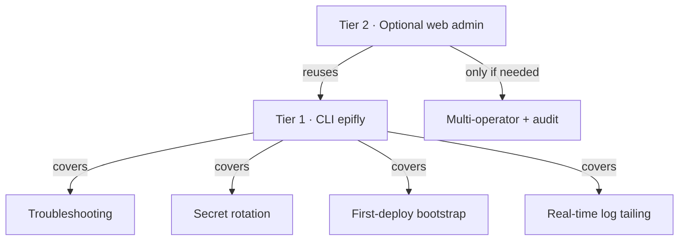
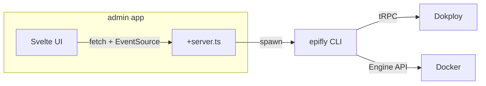
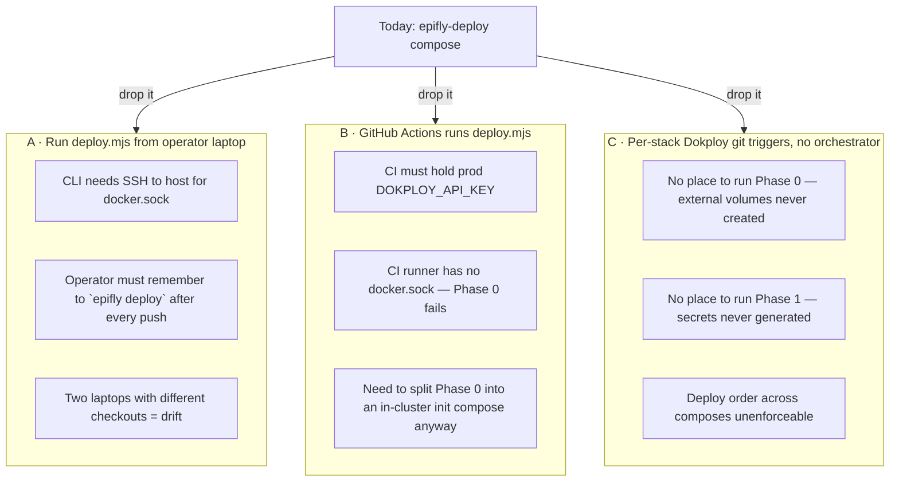

# `dokploy/` — Reasoning: should we build a step-by-step UI?

> Brief: User asks whether we should build an `epifly-deploy` UI for guided
> env setup, per-service config, script execution, and real-time logs — as a
> daily-driver troubleshooting tool. This file is the analysis & recommendation.
>
> TL;DR — **No new web UI.** Dokploy is already the UI. Instead build a
> small **CLI (`epifly`)** that wraps the existing `.mjs` scripts, streams
> deploy logs, and exposes a guided wizard for first-time bootstrap. If a
> web admin surface is genuinely needed later, add it as a tiny SvelteKit
> page mounted at `admin.${APP_DOMAIN}` behind Zitadel — reusing the
> existing UI stack — but not before the CLI lands.

---

## 1. What we have today

| Surface | File / Tool | Purpose |
|---|---|---|
| Declarative manifest | [dokploy/.env.example](../.env.example) | Source of truth for Shared Env keys |
| Secret generator | [dokploy/generate-prod-env.mjs](../generate-prod-env.mjs) | Local dev → produces `.env.production`, mode 0600 |
| Orchestrator | [dokploy/epifly-deploy/scripts/deploy.mjs](../epifly-deploy/scripts/deploy.mjs) | 6-phase reconciler (volumes → secrets → composes → domains → deploys → verify) |
| Domain sync | [dokploy/scripts/sync-domains.mjs](../scripts/sync-domains.mjs) | Registers hosts from `domains.yaml` via tRPC |
| Wipe tool | [dokploy/scripts/wipe-volumes.sh](../scripts/wipe-volumes.sh) | Destructive volume reset (per-volume / `--all`) |
| API smoke test | [dokploy/test-dokploy-api.mjs](../test-dokploy-api.mjs) | Sanity check for `DOKPLOY_API_KEY` |
| Per-stack composes | `infra/`, `gateway/`, `web/`, `observability/`, `capabilities/` | One Dokploy "Compose" app each |

Operator workflow today (tag-triggered):


**Already provided by Dokploy itself, for free:**

- Real-time deploy logs (SSE/WebSocket, ANSI-rendered).
- Per-service container logs + interactive shell.
- Per-compose env editor + Shared Env editor (with masking).
- Healthcheck status, redeploy / restart / stop buttons.
- Git-backed deploys with tag triggers.
- Domain + Let's Encrypt management.

## 2. Should we build a step-by-step UI for env + config + scripts?

### 2.1 What "step-by-step UI" would mean

A wizard that walks the operator through:

1. Enter `APP_DOMAIN`, `DOKPLOY_*` bootstrap creds.
2. Choose / generate POSTGRES / RUSTFS / PLATFORM_ADMIN creds.
3. Inject OPENAI / ANTHROPIC / STRIPE keys.
4. Click "configure infra", "configure gateway", … per service.
5. Run scripts (`deploy.mjs`, `wipe-volumes.sh`, `sync-domains.mjs`,
   `generate-prod-env.mjs`) with a button.
6. Stream stdout/stderr live in the browser.
7. Surface errors with remediation links.

### 2.2 Where this conflicts with the current design

| Friction | Detail |
|---|---|
| **Duplicates Dokploy** | Env editor, log stream, redeploy button — all exist. Re-implementing is wasted effort and another attack surface. |
| **Breaks declarative model** | Today: env is in git (`.env.production`) → tag triggers deploy → audit trail is the git log. A UI that mutates Shared Env directly via tRPC re-introduces drift between repo and live state — the exact problem `STATEFUL_SECRETS` and the snapshot fix in `deploy.mjs` were built to solve. |
| **Bootstrap is one-time** | The wizard's biggest win (initial setup) is a once-per-environment event. A 200 LOC CLI script captures it more cheaply than a SPA. |
| **Secrets-in-a-browser** | A web UI that handles `POSTGRES_PASSWORD`, `LAGO_RSA_PRIVATE_KEY`, `OPENAI_API_KEY` raises the bar for CSRF, session hardening, audit log, RBAC. The risk/reward is poor when the audience is "the platform team". |
| **AI-implementation cost** | A full UI = SvelteKit page + API + auth + form schemas + log streaming + tRPC client + tests. The CLI alternative is 3–5 files. |

### 2.3 Where a UI is genuinely useful

1. **Troubleshooting**: jumping between Dokploy's per-service logs is slow.
   A single pane that tails *all* relevant streams (deploy.mjs + container
   logs for the failing service + last 50 healthcheck probes) is real value.
2. **Secret rotation**: a guided "rotate `OPENAI_API_KEY`" flow with
   built-in pre-flight (volume snapshot warning) and post-flight verify is
   safer than editing Shared Env by hand.
3. **First-deploy bootstrap**: 7 env vars + 1 GitHub PAT + 1 tag. A wizard
   removes a 30-minute README walkthrough.

These three are achievable **without** a full UI: a CLI with sub-commands
covers all of them.

## 3. Recommendation — stack it in tiers



### Tier 1 — **Build now: `epifly` CLI** (1–2 day spike)

A single Node 22 binary (or pnpm workspace package) that wraps every
existing `.mjs` script. Distributed as `pnpm dlx @conusai/epifly` or a
homebrew tap.

**Sub-commands:**

| Command | Wraps | New behaviour |
|---|---|---|
| `epifly init` | `generate-prod-env.mjs` | Interactive wizard for the 7 bootstrap vars + Dokploy creds; writes `.env.production` + uploads Shared Env via tRPC; one-shot. |
| `epifly deploy [--dry-run] [--only=env\|composes\|domains\|deploys\|verify]` | `deploy.mjs` | Triggers the orchestrator remotely via Dokploy API and tails logs locally. |
| `epifly logs <app> [--follow]` | Dokploy tRPC `docker.logs` | Multi-stream tail across infra/gateway/web. |
| `epifly verify` | the `verify()` phase of `deploy.mjs` | Runs Phase 5 standalone — fast smoke test after manual changes. |
| `epifly secret rotate <KEY>` | `deploy.mjs` SECRETS map | Pre-flight (volume snapshot warning) → generate → PUT Shared Env → redeploy → verify. |
| `epifly wipe [--lago\|--all]` | `wipe-volumes.sh` | Runs the existing shell over SSH; same flags. |
| `epifly status` | tRPC `compose.allByEnvironment` | Table of {app, status, last-deploy-tag, healthchecks}. |
| `epifly diff` | local `.env.production` vs. Shared Env | Highlights drift; flags stateful keys. |

**Library choices (LLM-friendly, no exotic deps):**

| Concern | Pick | Why |
|---|---|---|
| Command parser | **`commander`** | Most common Node CLI lib; well-known to every LLM; declarative. |
| Prompts / wizard | **`@clack/prompts`** (or `@inquirer/prompts`) | Modern, accessible, single import, great DX, AI-easy to template. |
| Terminal UI / log tail | **`ink`** (React for terminals) or pure `picocolors` + `cli-spinners` | Ink lets us show a multi-pane log view; for v1 keep it line-based with `picocolors`. |
| Streaming logs | Native `fetch` + `ReadableStream` against Dokploy's SSE | Node 22 built-in, zero deps. |
| Schema validation | **`zod`** | Validate bootstrap-env input; reuse later in web. |
| Build | **`tsup`** | Single-file ESM/CJS output; ~10 lines of config. |
| Test | Node's built-in `node:test` | No extra runner. |

> Rule of thumb: every dep must be a name an LLM autocompletes on the
> first try. `commander`, `zod`, `@clack/prompts`, `ink`, `tsup` all do.

### Tier 2 — **Only if needed later: SvelteKit admin app**

If multiple operators / non-CLI users / audit requirements emerge, mount
a thin admin app at `admin.${APP_DOMAIN}`:

- **SvelteKit + Svelte 5 runes** (already in stack — see [docs/shadcn-svelte.md](../../docs/shadcn-svelte.md)).
- **shadcn-svelte** for forms, dialogs, stepper (already adopted).
- **`xterm.js` + SSE** for ANSI log rendering — same data pipe the CLI uses.
- **Zitadel** OIDC for SSO; `platform_admin` claim required.
- **Backend**: tiny `+server.ts` endpoints that **shell out to the same
  `epifly` CLI binary** — single code path for both surfaces, no logic
  duplication.



**Don't build Tier 2 first.** The CLI is what 95% of troubleshooting needs;
the web app is icing.

### Anti-patterns to avoid

- ❌ A "configure service X" page that PUTs env directly to Dokploy. Use git.
- ❌ Re-implementing Dokploy's deploy log UI. Embed or link to it.
- ❌ Persisting secrets in a separate database for the admin app. The CLI
  reads `.env.production` or Dokploy Shared Env; never a third store.
- ❌ Adding a `package.json` to `dokploy/` itself. Keep the orchestrator
  zero-dependency (Node stdlib only) so it runs in `node:22-alpine`
  without `pnpm install`. The CLI lives in `tools/epifly/` instead.

## 4. Cold-start: how `epifly` works when nothing exists yet

The interesting question: **`epifly init` runs against a Dokploy instance
where the `epifly-deploy` compose doesn't exist yet.** How does it
bootstrap itself?

### 4.1 What the operator must do by hand (unavoidable, ≈5 min)

These four are outside Dokploy's API surface — no CLI can do them for you:

| Step | Where | Why it's manual |
|---|---|---|
| 1. Provision a host | Hetzner / DO / bare metal | Out of scope. |
| 2. Install Dokploy | `curl … \| sh` from docs.dokploy.com | One-time, host-level. |
| 3. Point DNS | Registrar | `*.epifly.<env>.cloud.conusai.com` → host IP. Cert resolver needs it. |
| 4. Mint API key | Dokploy UI → Settings → API Keys | You can't issue an API key with an API key. |

Outputs the operator carries forward: `DOKPLOY_URL`, `DOKPLOY_API_KEY`,
a GitHub account/PAT connected inside Dokploy (so the orchestrator can
clone this repo).

### 4.2 What `epifly init` does (automated, ≈30 s)

Everything from "Dokploy is reachable" through "first deploy is running"
is one command. The CLI talks to the same tRPC API that `deploy.mjs`
already uses — `compose.create`, `environment.update`, `compose.deploy`,
`project.create`, `github.all`, etc.

```mermaid
sequenceDiagram
  autonumber
  participant Op as Operator
  participant CLI as epifly init
  participant Dokploy as Dokploy tRPC
  participant GH as GitHub
  participant Compose as epifly-deploy compose
  participant Mjs as deploy.mjs (Phase 0–5)

  Op->>CLI: epifly init
  CLI->>Op: prompt: DOKPLOY_URL, DOKPLOY_API_KEY, APP_DOMAIN
  Note over CLI: Reads dokploy/.dokploy if present (skip prompts)
  CLI->>Dokploy: project.all + project.create(name="Epifly") if missing
  Dokploy-->>CLI: { projectId, environmentId }
  CLI->>Dokploy: github.all → resolve githubId for this repo
  alt no GitHub provider configured
    CLI->>Op: print URL to "Settings → Git Providers"; abort
  end
  CLI->>CLI: generate-prod-env equivalent (in-memory) — fills changeme_*
  CLI->>Dokploy: environment.update(env=Shared Env merged)
  CLI->>Dokploy: compose.create(name="epifly-deploy", githubId, branch=main,<br/>composePath="./dokploy/epifly-deploy/docker-compose.yml",<br/>triggerType=tag, composeType=docker-compose)
  Dokploy-->>CLI: { composeId }
  CLI->>Dokploy: environment.update (per-compose env on this composeId:<br/>APP_DOMAIN, DOKPLOY_URL, DOKPLOY_API_KEY, DOKPLOY_ENVIRONMENT_ID,<br/>+ optional pinned POSTGRES_*, AWS_*, PLATFORM_ADMIN_TOKEN)
  CLI->>Dokploy: compose.deploy(composeId)
  Dokploy->>GH: clone repo @ branch main
  Dokploy->>Compose: docker compose up (node:22-alpine)
  Compose->>Mjs: node /app/scripts/deploy.mjs
  Mjs->>Dokploy: Phase 1 → environment.update (Shared Env w/ generated secrets)
  Mjs->>Dokploy: Phase 2 → compose.create for infra/gateway/web/observability/capabilities
  Mjs->>Dokploy: Phase 3 → domain.create per domains.yaml
  Mjs->>Dokploy: Phase 4 → compose.deploy in order
  Mjs-->>CLI: phase events (tailed via SSE)
  CLI->>Op: ✓ Epifly deployed at https://${APP_DOMAIN}
```

### 4.3 Why `epifly init` doesn't *replace* `deploy.mjs`

They run in two different places with two different jobs:

| | `epifly init` (CLI) | `deploy.mjs` (orchestrator) |
|---|---|---|
| Runs on | Operator's laptop | Inside Dokploy on the host |
| Triggered by | Human, once per environment | Every git tag push, forever |
| Talks to | Dokploy tRPC | Dokploy tRPC + Docker Engine API (`/var/run/docker.sock`) |
| Knows about | Just enough to create the `epifly-deploy` compose itself | All 5 child stacks + volumes + domains + verify |
| Idempotent | Yes (skips if compose exists) | Yes (the whole point) |
| Can mutate volumes | No | Yes (Phase 0) |

So `init` is intentionally thin: **its only job is to make `deploy.mjs`
exist.** Everything after that is the orchestrator's job — which is
exactly what we already have today, just driven by a `git push --tags`
instead of a 6-field web form.

### 4.4 What happens on the *second* environment / disaster recovery

```sh
# Fresh host, fresh Dokploy, same repo:
epifly init --env staging --domain epifly.staging.cloud.conusai.com
# → walks the same flow, ends with a running staging stack.

# Reuse same .dokploy creds file but different env:
DOKPLOY_PROJECT_URL=… epifly init
# → idempotent: if compose exists, skips create; only re-applies env.
```

For disaster recovery (host wiped, Dokploy reinstalled, volumes lost),
`epifly init` + `git push --tags` reproduces the entire stack from
declarative config + Shared Env values stored in the operator's
password manager. **No UI clicks past step 4 in §4.1.**

### 4.5 What `epifly init` is *not*

- Not a one-time script — re-running is safe and useful (drift fix).
- Not a secret store — it reads `dokploy/.dokploy` + `.env.production`
  (gitignored, mode 0600) or prompts; never writes secrets to disk
  outside those files.
- Not authoritative — Shared Env in Dokploy + git tags remain the
  source of truth. `init` just seeds them.

## 5. Do we even need `epifly-deploy`?

Fair pushback once a CLI exists. The honest answer: **no, not strictly —
but every alternative trades one piece of complexity for two.** Keep it.

### 5.1 What `epifly-deploy` uniquely gives us

| Capability | Why it has to run *inside* Dokploy on the host |
|---|---|
| **Docker Engine API access** (Phase 0 — external volume creation) | Needs `/var/run/docker.sock` mounted. Operator laptops + GitHub Actions runners don't have this without SSH tunnels. |
| **Tag-triggered, hands-off deploys** | `git push --tags` → Dokploy webhook → `compose.deploy` → `deploy.mjs`. No human in the loop, no laptop required, identical behaviour for solo devs and CI pipelines. |
| **No long-lived credentials off-host** | `DOKPLOY_API_KEY` lives in the per-compose env on the host. Nothing in CI, nothing on laptops. |
| **Audit trail** | Every reconcile is a row in Dokploy's deploy history for the `epifly-deploy` compose. Git tag ↔ deploy run ↔ logs. |
| **Right commit, right place** | Dokploy clones the repo at the exact tag SHA before running `deploy.mjs`. The orchestrator can never be out of sync with the tag that triggered it. |

### 5.2 Each alternative and what it costs



| Option | What dies | What's added |
|---|---|---|
| **A. Laptop-driven** | Tag-triggered automation, "push and walk away" | SSH key mgmt for docker.sock, drift between laptops |
| **B. CI-driven (GitHub Actions)** | Single source of truth for credentials | Prod API key in GitHub Secrets, *and* a separate in-cluster compose for Phase 0 — so you end up rebuilding a slimmer `epifly-deploy` anyway |
| **C. Pure Dokploy native** | Phases 0/1, dependency ordering, secret generation, domain sync, verify | Manual UI clicks per environment, no declarative source of truth |

### 5.3 Could the CLI *replace* it?

Almost — but the missing piece is "where does the Docker socket call
come from on first deploy?" Three honest paths forward:

1. **Status quo (recommended).** Keep `epifly-deploy` as the in-cluster
   reconciler. The CLI becomes a thin client that triggers it
   (`epifly deploy` → `compose.deploy` over tRPC) and tails the logs.
   Both surfaces share `deploy.mjs` as the single implementation —
   the CLI does *not* re-implement orchestration logic.
2. **Shrink `epifly-deploy` to a volume-init shim.** Move Phase 0 into a
   tiny one-shot compose that *only* pre-creates external volumes. Move
   Phases 1–5 into the CLI, triggered from CI. Net: still two pieces, but
   the cluster-side piece becomes 20 lines instead of 700.
3. **Eliminate the docker.sock dependency entirely.** Switch external
   volumes to *implicit* compose volumes (drop `external: true`). Then
   Phase 0 disappears and the CLI can do everything from anywhere.
   **Cost:** lose the lifecycle decoupling that survives project deletes
   and accidental `docker compose down -v` — the exact property the
   `STATEFUL_SECRETS` guard was built around. Not worth it.

### 5.4 Verdict

`epifly-deploy` is **30 lines of YAML + a mounted docker.sock + a node
runtime**. The thing it costs us is essentially nothing; the thing it
buys us — *a place to run Docker Engine API calls scoped to a single
project, triggered by git tags, with no off-host credentials* — has no
clean substitute.

> **Keep `epifly-deploy`. Add the CLI as a triggering + tailing client,
> not a replacement.** The CLI and the orchestrator share `deploy.mjs`
> as the canonical implementation; neither owns logic the other has to
> re-derive.

If we ever do remove it, Option 2 above (volume-init shim + CLI-driven
phases) is the sane path — but defer until there's concrete pain.

## 6. Concrete next steps (proposed)

1. Land the existing `wipe-volumes.sh` + Lago upstream alignment (✅ done).
2. Add `tools/epifly/` workspace package — `pnpm` workspace member.
3. Port `generate-prod-env.mjs` interactive paths into `epifly init`.
4. Port the `verify()` phase to `epifly verify` for fast feedback loops
   that don't require a tag push.
5. Wire `epifly logs --follow infra,gateway,web` against Dokploy's SSE.
6. Document in [dokploy/README.md](../README.md) as the recommended
   operator tool; keep the "edit git, push tag" flow as the canonical
   path — the CLI just makes it faster.

Reassess Tier 2 only after 4 weeks of CLI use reveals a real gap.

---

### Appendix · references consulted

- Dokploy variable model (Shared Env vs. compose env): https://docs.dokploy.com/docs/core/variables
- Dokploy compose API (`compose.deploy`, `compose.update`): `dokploy/packages/server/src/api/routers/compose.ts` (upstream).
- `@clack/prompts` — modern wizard UX: https://github.com/natemoo-re/clack
- Ink — React renderer for CLIs: https://github.com/vadimdemedes/ink
- Internal: [project-instructions.md](../../docs/project-instructions.md), [shadcn-svelte.md](../../docs/shadcn-svelte.md).
