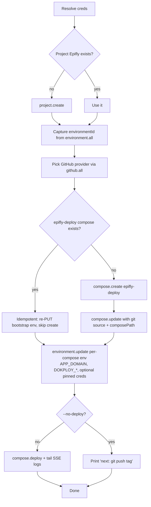
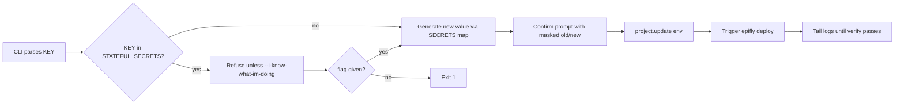
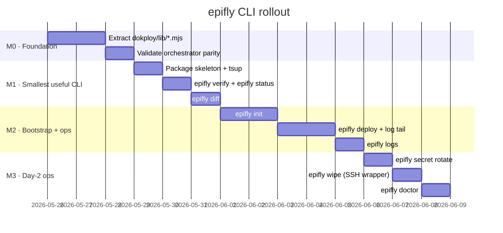

# `epifly` CLI — detailed implementation plan

> Companion to [arch.md](arch.md) and the existing
> [epifly-deploy](../epifly-deploy/scripts/deploy.mjs) orchestrator.
> This plan turns the analysis in §1–§5 of arch.md into an actionable
> build that ships in four small milestones (M0 → M3).
>
> **Design rule, non-negotiable:** the CLI never re-implements
> orchestration logic. `deploy.mjs` stays the single source of truth.
> The CLI is a *thin client* — extracts shared helpers into a library,
> talks to Dokploy tRPC, and tails logs over SSE.

---

## 1. Goals & non-goals

### Goals (M0–M3)

1. One command (`epifly init`) reproduces today's manual Dokploy-UI
   bootstrap walkthrough end-to-end, idempotently.
2. One command (`epifly deploy`) triggers a reconcile via the existing
   `epifly-deploy` compose and tails its logs locally.
3. One command (`epifly logs <app>`) tails any child compose's logs
   without leaving the terminal.
4. One command (`epifly verify`) runs Phase 5 standalone — fast feedback
   loop that does not require a git tag push.
5. One command (`epifly secret rotate <KEY>`) safely rotates a Shared
   Env value, respecting the `STATEFUL_SECRETS` guard.
6. Drift detection: `epifly diff` shows local `.env.production` vs.
   live Shared Env, highlighting stateful keys.
7. Zero new long-lived credentials — same `DOKPLOY_API_KEY` the
   orchestrator already uses, sourced from `dokploy/.dokploy`.

### Non-goals

- No replacement for `epifly-deploy`. The CLI never bypasses it.
- No web UI in M0–M3. Stays a TTY tool.
- No new dependency on `pnpm` for the orchestrator (`deploy.mjs` stays
  zero-dep, Node-stdlib only — runs in `node:22-alpine`).
- No mutation of stateful volumes from the CLI itself. Wipe still
  goes through `dokploy/scripts/wipe-volumes.sh` over SSH.

---

## 2. Package layout

```
tools/epifly/                   ← new pnpm workspace member
├── package.json                ← name: @conusai/epifly, bin: epifly
├── tsconfig.json
├── tsup.config.ts              ← single-file ESM build → dist/epifly.mjs
├── README.md
├── src/
│   ├── cli.ts                  ← commander root, registers subcommands
│   ├── commands/
│   │   ├── init.ts             ← §3.1 — bootstrap wizard
│   │   ├── deploy.ts           ← §3.2 — trigger + tail
│   │   ├── logs.ts             ← §3.3 — multi-app log tail
│   │   ├── verify.ts           ← §3.4 — standalone Phase 5
│   │   ├── secret.ts           ← §3.5 — rotate subcommand
│   │   ├── status.ts           ← §3.6 — compose state table
│   │   ├── diff.ts             ← §3.7 — env drift
│   │   ├── wipe.ts             ← §3.8 — wraps wipe-volumes.sh via SSH
│   │   └── doctor.ts           ← §3.9 — pre-flight checks
│   ├── lib/                    ← *only* CLI-specific code
│   │   ├── config.ts           ← creds resolution
│   │   ├── prompts.ts          ← @clack/prompts wrappers
│   │   ├── log-tail.ts         ← SSE consumer
│   │   ├── ssh.ts              ← child_process('ssh') wrapper for wipe
│   │   └── ui.ts               ← picocolors banners, tables
│   └── index.ts                ← exports for programmatic use (tests)
└── tests/                      ← node:test
    ├── dotenv.test.ts
    ├── compose-vars.test.ts
    └── trpc-client.test.ts

dokploy/lib/                    ← new SHARED library (extracted from deploy.mjs)
├── trpc.mjs                    ← makeClient(), unwrap()
├── dotenv.mjs                  ← parseDotenv(), renderDotenv()
├── compose-vars.mjs            ← extractComposeVars(), renderProjectRefs()
├── secrets.mjs                 ← SECRETS map, STATEFUL_SECRETS map, gen helpers
├── manifest.mjs                ← APPS, EXTERNAL_VOLUMES, DERIVED
├── verify.mjs                  ← buildVerifyChecks(), runCheck()
└── docker.mjs                  ← dockerApi(), listExistingVolumes()
                                ←   (used by orchestrator only; CLI never imports this)
```

Why split this way:

- `dokploy/lib/*.mjs` are **zero-dep ESM modules** — both `deploy.mjs`
  (already zero-dep) and `tools/epifly` (TypeScript, transpiled) can
  import them. The orchestrator container layout doesn't change.
- `tools/epifly/src/lib/*` is the **TS-only** layer that needs `commander`
  / `@clack/prompts` / etc. None of it touches the orchestrator runtime.

### Build & distribute

| Step | Tool | Output |
|---|---|---|
| Build | `tsup src/cli.ts --format esm --target node22 --bundle` | `dist/epifly.mjs` |
| Local install | `pnpm --filter @conusai/epifly link --global` | `epifly` on `$PATH` |
| Release | `pnpm publish --access restricted` to internal registry | `pnpm dlx @conusai/epifly@latest …` |

---

## 3. Command-by-command spec

Every command shares this skeleton:

```ts
program
  .command("<name>")
  .description("…")
  .option("--dry-run", "print plan, do not mutate")
  .option("--json", "machine-readable output")
  .option("--no-color", "disable ANSI")
  .action(async (opts) => {
    const cfg = await loadConfig({ interactive: process.stdout.isTTY });
    const api = makeClient(cfg.dokployUrl, cfg.apiKey);
    await run(cfg, api, opts);
  });
```

### 3.1 `epifly init`

**Purpose:** automate the entire bootstrap section of
[epifly-deploy/docker-compose.yml](../epifly-deploy/docker-compose.yml)
header (the 6-step UI walkthrough).

**Inputs (resolution order):**

1. CLI flags: `--url`, `--api-key`, `--env-id`, `--domain`, `--repo`,
   `--branch`, `--non-interactive`.
2. `dokploy/.dokploy` (KEY="value" format, already gitignored).
3. `process.env`.
4. Interactive `@clack/prompts` if `process.stdout.isTTY` and missing.

**Flow:**



**Output of a clean run:**

```
✓ Project "Epifly" found (env: prod, id: env_xxx)
✓ GitHub provider: conusai/conusai-platform (githubId: gh_xxx)
✓ epifly-deploy compose ready (composeId: cmp_xxx)
✓ Bootstrap env applied (4 vars + 6 optional pinned)
▶ Triggering first deploy…
  [Phase 0] ensureVolumes → 6 volumes created
  [Phase 1] ensureSharedEnv → 18 keys generated, 4 inherited
  [Phase 2] ensureComposes → 5 created
  [Phase 3] syncDomains → 12 hosts registered
  [Phase 4] deployAll → infra ✓ gateway ✓ web ✓ observability ✓ capabilities ✓
  [Phase 5] verify → 7/7 checks passed
✓ Epifly is live at https://epifly.beta.test.cloud.conusai.com
```

**Idempotency contract:**

- Calling `init` twice changes nothing if config is unchanged.
- Calling `init` after a domain change updates only the per-compose env
  + Shared Env, does not re-create composes.
- Never overwrites a non-empty Shared Env value (matches `deploy.mjs`
  Phase 1 behaviour).

### 3.2 `epifly deploy`

**Purpose:** trigger a full reconcile from anywhere without `git push`.

**Behaviour:**

```ts
// Pseudocode
const composeId = await findCompose(api, "epifly-deploy");
await api.mutate("compose.deploy", { composeId });
await tailDeployLogs(api, composeId); // SSE
```

**Flags:**

- `--only env|composes|domains|deploys|verify` — propagates to
  `DEPLOY_ONLY=…` via per-compose env override before triggering.
- `--dry-run` — propagates to `DEPLOY_DRY_RUN=true`.
- `--watch` (default true) — tail logs until the run exits.
- `--tag vX.Y.Z` — alternative path: instead of triggering compose.deploy,
  create + push a git tag and let the webhook do it. Useful for
  enforcing tag-as-audit-record.

**SSE log tail** uses Dokploy's existing `/api/trpc/docker.getLogs`
subscription endpoint (already proven by `deploy.mjs` itself, which
reads from stdout that Dokploy captures).

### 3.3 `epifly logs <app> [<app>...]`

**Purpose:** real-time multi-stream tail.

**Args:**

- `<app>` — one or more of `infra | gateway | web | observability |
  capabilities | epifly-deploy`. Accepts `--all`.

**Output modes:**

- Default: interleaved lines, prefixed `[<app>] `, with `picocolors`
  hue per app.
- `--split` (requires Ink): one terminal pane per app, vertically split.

**Implementation:** subscribe via SSE per-compose, multiplex into one
`Readable`, render with `picocolors`. Ink is opt-in to keep the binary
small (lazy-loaded only when `--split` is passed).

### 3.4 `epifly verify`

**Purpose:** run Phase 5 (`verifyAll`) standalone from the CLI host —
no Docker socket needed, just HTTPS.

**Behaviour:** imports `dokploy/lib/verify.mjs` directly. Resolves
`APP_DOMAIN` from `.dokploy` or `--domain` flag. Returns exit code 0/1
for CI use.

**Why this is in M0:** highest value/effort ratio. It's already a pure
function in `deploy.mjs` (no docker.sock, no tRPC) — extracting it to
`dokploy/lib/verify.mjs` is ~30 lines and unlocks `epifly verify`.

### 3.5 `epifly secret rotate <KEY>`

**Purpose:** safely rotate a Shared Env value.

**Flow:**



**Stateful-key behaviour:** the CLI duplicates the `STATEFUL_SECRETS`
map (or, better, imports it from `dokploy/lib/secrets.mjs`) so its
guard is identical to `deploy.mjs` Phase 1.

### 3.6 `epifly status`

Prints a table:

```
APP             STATUS    LAST DEPLOY              TAG       HEALTH
infra           done      2026-05-25 12:04:11Z     v0.1.2    ✓ postgres ✓ redis ✓ qdrant ✓ rustfs ✓ zitadel ✓ lago
gateway         done      2026-05-25 12:04:55Z     v0.1.2    ✓ /health
web             done      2026-05-25 12:05:30Z     v0.1.2    ✓ /
observability   done      2026-05-25 12:06:01Z     v0.1.2    ✓ /
capabilities    done      2026-05-25 12:06:30Z     v0.1.2    ✓ current-time
epifly-deploy   idle      2026-05-25 12:06:31Z     v0.1.2    —
```

Data sources: `compose.search` for the row, `compose.one` for `composeStatus`
and `git.tag`, `runCheck()` from `lib/verify.mjs` for the health column.

### 3.7 `epifly diff`

Compares local `.env.production` with the live project env from
`project.one`. Highlights:

- `+` keys in local not in remote
- `-` keys in remote not in local
- `~` value differences (masked for secrets)
- `⚠` value differences on `STATEFUL_SECRETS` keys (red, with the
  "do not regenerate" warning)

Exit code 0 = no drift, 1 = drift, 2 = stateful drift.

### 3.8 `epifly wipe`

**Purpose:** wrapper around `dokploy/scripts/wipe-volumes.sh` for
remote hosts.

**Flow:** SSH into the Docker host (using
`~/.ssh/config` `Host dokploy` block by convention), copies the script
if missing, runs it with the same flags. Stays a thin shell — never
re-implements wipe logic.

**Flags:** `--host <hostname>` (default: `dokploy`), pass-through for
`--lago`, `--postgres`, `--all`, `--yes`, `--no-backup`.

### 3.9 `epifly doctor`

Read-only diagnostic. Each check is one line, `✓ / ✗ / ⚠`:

- DNS: `*.${APP_DOMAIN}` resolves to the same IP as `${APP_DOMAIN}`.
- HTTPS: certs valid, expiry > 14 days.
- Dokploy API: reachable, key works (`auth.me`).
- Project Shared Env: every key in `.env.example` is present.
- All 6 external volumes exist (via `compose.one` inspect — Dokploy
  exposes this without needing docker.sock on the laptop).
- Zitadel OIDC discovery returns a valid `issuer`.
- Lago `/health` returns 200.
- RustFS responds with `403` to anonymous list (proves it's up).
- Last `epifly-deploy` run status.

Used as a first stop in troubleshooting: `epifly doctor` should
fingerprint the problem in <5 s.

---

## 4. Shared library extraction (M0 prerequisite)

The CLI cannot exist without this step. Move from `deploy.mjs`:

| Move to | Functions / consts |
|---|---|
| `dokploy/lib/trpc.mjs` | `makeClient`, `unwrap` |
| `dokploy/lib/dotenv.mjs` | `parseDotenv`, `renderDotenv`, `isSecret` |
| `dokploy/lib/compose-vars.mjs` | `extractComposeVars`, `renderProjectRefs` |
| `dokploy/lib/secrets.mjs` | `SECRETS`, `STATEFUL_SECRETS`, `randB64Url`, `randHex`, `randUpperAlnum`, `base64`, `generateRsaPem` |
| `dokploy/lib/manifest.mjs` | `APPS`, `EXTERNAL_VOLUMES`, `DERIVED` |
| `dokploy/lib/verify.mjs` | `buildVerifyChecks`, `runCheck` |
| `dokploy/lib/docker.mjs` | `dockerApi`, `listExistingVolumes` |

`deploy.mjs` becomes ~250 lines of phase glue importing from
`../lib/*.mjs`. Bind-mount adjustment in the orchestrator compose:

```yaml
volumes:
  - ./scripts:/app/scripts:ro
  - ../lib:/app/lib:ro        # ← new
  - ../scripts/sync-domains.mjs:/app/sync-domains.mjs:ro
  …
```

Then in TypeScript: `import { SECRETS } from "../../../dokploy/lib/secrets.mjs"`
(works because `tsup` handles ESM `.mjs` resolution natively).

**Validation:** existing E2E behaviour identical — the orchestrator
must produce the same Phase logs after extraction as before. Diff
the output of a `--dry-run` against staging pre/post refactor.

---

## 5. Configuration & credential model

```ts
type Config = {
  dokployUrl: string;        // https://dokploy.beta.test.cloud.conusai.com
  apiKey: string;            // x-api-key header
  environmentId: string;     // env_xxx
  projectId: string;         // resolved at runtime from environment.one
  appDomain: string;         // epifly.beta.test.cloud.conusai.com
  composeIds: Record<AppName, string>; // resolved lazily
};
```

**Resolution precedence (highest first):**

1. CLI flag (e.g. `--api-key`)
2. `process.env.DOKPLOY_*`
3. `dokploy/.dokploy` (parsed once at startup)
4. Interactive prompt (TTY only)
5. Error with remediation message

**Never persisted by the CLI:** the CLI only reads `dokploy/.dokploy`,
it does not write it. `epifly init` may *suggest* a `dokploy/.dokploy`
content block but prints it for the user to save manually. This keeps
the secret-handling surface tiny.

---

## 6. Error UX

| Error class | Example | Behaviour |
|---|---|---|
| Missing credential | `DOKPLOY_API_KEY` empty | Print "Get one at <url> → Settings → API Keys", exit 1 |
| tRPC 401 | Stale key | Print "Re-run `epifly init` with `--api-key`", exit 1 |
| tRPC 404 on compose | Compose deleted | Suggest `epifly init` to recreate, exit 1 |
| Stateful guard trip | Rotating bound key | Print full remediation paragraph (matches `deploy.mjs`), exit 2 |
| Network timeout | Dokploy unreachable | Retry 3× with exponential backoff before failing |
| Phase failure | One compose deploys errored | Print last 50 log lines, link to Dokploy UI, exit 1 |

Exit codes follow `sysexits.h` conventions where possible (`64` =
usage, `69` = service unavailable, `78` = config).

---

## 7. Testing strategy

| Layer | Runner | Targets |
|---|---|---|
| Unit | `node:test` | dotenv parser, compose-var extractor, secrets gen shapes, dokploy URL parsing, stateful-guard logic |
| Contract | `node:test` + `msw`-like local mock | tRPC client against recorded JSON fixtures of `compose.one`, `environment.one`, `project.update` |
| Integration | `node:test` + nock-style HTTP intercept | Full `init` flow against a mocked Dokploy |
| E2E (manual) | Ephemeral Dokploy on Docker | `epifly init --domain test.local` → verify Phase 5 passes |

CI matrix: Node 22 on macOS + Linux. No need for Windows.

---

## 8. Milestones



| Milestone | Definition of done |
|---|---|
| **M0 — Foundation** | `deploy.mjs` works identically after extraction; `dokploy/lib/*.mjs` has 80% unit-test coverage; orchestrator container layout unchanged from operator's POV |
| **M1 — Smallest useful CLI** | `pnpm dlx @conusai/epifly verify` and `… status` and `… diff` work against the current production stack |
| **M2 — Bootstrap + ops** | `epifly init` reproduces a fresh environment end-to-end without UI clicks past §4.1; `epifly deploy --watch` tails live |
| **M3 — Day-2 ops** | Rotation, wipe-via-SSH, and `doctor` documented in the dokploy README as the recommended operator path |

After M3, reassess whether to build a web admin (Tier 2 in arch.md §3).

---

## 9. Risks & mitigations

| Risk | Likelihood | Impact | Mitigation |
|---|---|---|---|
| Dokploy tRPC schema change between versions | Med | High | Pin a known-good Dokploy version in `dokploy/.dokploy`; `epifly doctor` checks `auth.me` returns expected fields; record fixtures per Dokploy version |
| Shared lib extraction breaks orchestrator | Low | High | Run staging `--dry-run` diff before/after each move; merge in one PR per file |
| API key leakage via `--api-key` in shell history | Med | High | Always prefer `.dokploy` file; warn if `--api-key` passed; never log key |
| SSE log tail flake on slow connections | Med | Low | Auto-reconnect with last-event-id; cap reconnect attempts at 5 |
| Stateful-secret drift between local `.env.production` and live | High | Critical | `epifly diff` exit code 2; `epifly secret rotate` is the only sanctioned path |
| Operator runs `epifly init` against wrong environment | Low | Critical | Banner prints `DOKPLOY_URL`, `projectId`, `appDomain`; type-the-domain confirmation in non-interactive mode without `--yes` |

---

## 10. Open questions (to resolve during M0)

1. **Where do the bin** does `tools/epifly` live in the repo root or
   under `apps/`? Proposal: `tools/` (already exists for one-off tooling).
2. **Should `epifly logs --split` ship in M2 or be deferred to M3?**
   Ink adds ~500 KB to the bundle. Recommendation: defer; lazy-load.
3. **`epifly wipe` SSH UX** — assume `Host dokploy` in `~/.ssh/config`
   or prompt for hostname every run? Recommendation: prompt only if
   `--host` not given and no `dokploy` host alias exists.
4. **Telemetry?** No, unless explicit opt-in. Operator tooling stays
   anonymous by default.

---

## 11. Appendix · references

- Current orchestrator: [epifly-deploy/scripts/deploy.mjs](../epifly-deploy/scripts/deploy.mjs)
- Bootstrap walkthrough: [epifly-deploy/docker-compose.yml](../epifly-deploy/docker-compose.yml)
- Volume wipe script: [scripts/wipe-volumes.sh](../scripts/wipe-volumes.sh)
- Domain sync (already a shared script): [scripts/sync-domains.mjs](../scripts/sync-domains.mjs)
- API smoke test (becomes obsolete after `epifly doctor`): [test-dokploy-api.mjs](../test-dokploy-api.mjs)
- Architecture/reasoning: [arch.md](arch.md)
